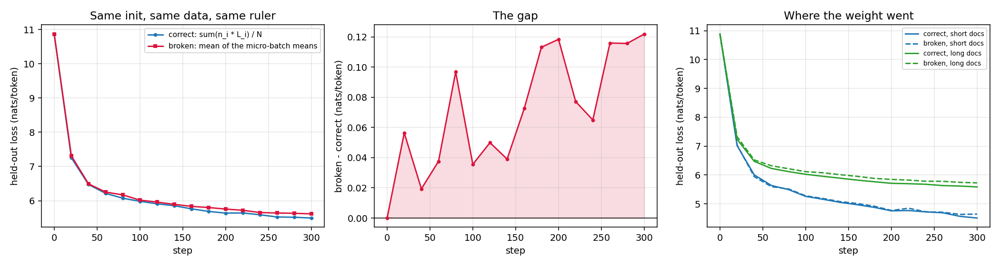
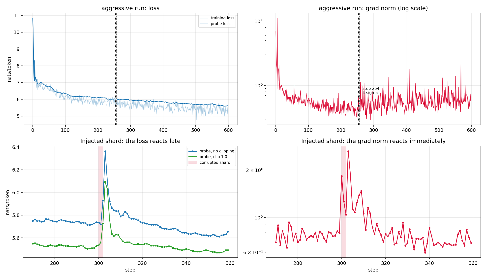
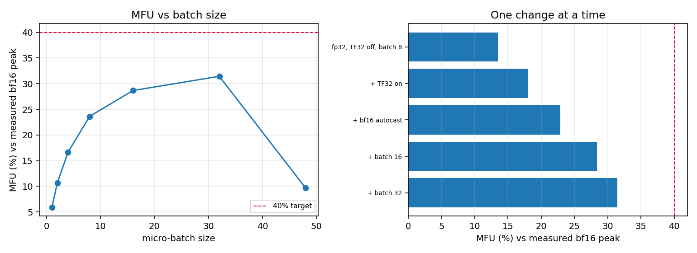
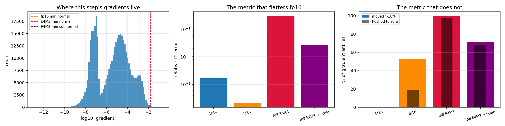

# Session 10 — Make the training step tell you the truth about itself

[](https://github.com/subramanyanaik/schoolofai_subbu/actions/workflows/validate.yml)
[](https://colab.research.google.com/github/subramanyanaik/schoolofai_subbu/blob/main/assignment10/truth_harness.ipynb)


**Session-10 assignment.** A small model (nanoGPT's architecture) and a real training loop,
instrumented until it stops being a black box. Six questions, each answered by a measurement.

> **Notebook:** [`truth_harness.ipynb`](truth_harness.ipynb) — executed end to end with
> `nbclient` on a local CUDA GPU (RTX 3050 Laptop, 4 GiB, torch 2.5.1+cu121); the committed
> file carries that run's outputs. Use a GPU runtime.
> **Source of truth:** [`truth_harness.py`](truth_harness.py). The notebook is generated from
> it, cell for cell, and CI fails if the two drift.
> **Every number below:** [`results/results.json`](results/results.json), emitted by the run,
> injected into this README by [`tools/render_numbers.py`](tools/render_numbers.py), and
> checked by CI. Nothing here is typed by hand.

---

## What was asked, and what came back

| # | the assignment | the short answer |
|---|---|---|
| 1 | print every tensor shape in the step, one line per dimension | done, and *audited* three ways — no tensor is described from memory |
| 2 | verify one gradient by hand | agrees with `backward()` to the limit of what float64 can confirm; the setup found a real NaN bug in torch on the way |
| 3 | break gradient accumulation on purpose | broken and plotted; the correct rule is shown to be *exactly* the un-accumulated gradient |
| 4 | find a step where the grad norm moved before the loss | the general claim **does not hold**; the specific one does, and both are reported |
| 5 | compute your own MFU, honestly | measured against a ceiling measured on this machine, and the distance to 40% split into what the loop can and cannot fix |
| 6 | 0.1 in fp32, bf16, fp8 E4M3, showing the bits | derived in exact rational arithmetic, checked bit-for-bit against torch |

Three of these produced answers I did not expect when I started, and they are the parts worth
reading: the NaN in §2, the negative result in §4, and the MFU attribution in §5 coming out
the opposite way round from the one I was about to assert.

---

<!-- BEGIN:numbers -->

## 1. Every tensor shape in the step

One step at `B=8`, `T=128`, on a 16,058,112-parameter model with `C=256`, `L=4` blocks, `nh=4` heads and `V=50,257`. **28 tensors** are printed with the meaning of every axis; the full trace with all 4 blocks expanded (112 rows) is in [`results/shapes_full.txt`](results/shapes_full.txt).

| what | value |
|---|---|
| activations traced in one step | **228.5 MiB** |
| of which `logits [B,T,V]` alone | **196.3 MiB (85.9%)**, because `V/C = 196` |
| weights + grads + Adam's two moments | **245.0 MiB** = **16 bytes per parameter** at fp32 (52 parameters x 4 tensors each) |
| blocks are shape-identical | 17 interior tensors, the same in all 4 |

The three audits, because a shape table written from memory proves nothing:

| audit | result |
|---|---|
| every leaf module's output shape appears in the trace | **41 module calls**, 0 shapes missing |
| `dL/dX` has `X`'s own shape, for every traced activation | **25 checked**, 0 mismatches — so the backward pass introduces no shape the forward pass did not already show |
| the traced explicit attention == the fused kernel training uses | max logit difference **1.4e-06**, loss difference **9.5e-07** |

The last one matters for a reason worth stating: the `[B, nh, T, T]` attention-score tensor printed in the trace is real, but the fused kernel the training loop actually runs **never builds it**. That is what flash attention *is*. Printing every tensor required a second, explicit code path, and then required proving the two agree.

## 2. One gradient, verified by hand

`transformer.h.0.mlp.c_fc.weight[0, 0]`, in float64 on the CPU, dropout off, one fixed batch.

| | |
|---|---|
| `backward()` reports | `-0.002766727918451` |
| central difference at the best `h` = 1e-04 | `-0.002766727922321` |
| relative error | **1.40e-09** |
| **they agree to** | **8.9 significant decimal digits** |

The step size sweep is the point of the exercise, not a detail — there is a best `h` and the error rises on *both* sides of it:

| h | 1e-01 | 1e-02 | 1e-03 | 1e-04 | 1e-05 | 1e-06 | 1e-07 | 1e-08 | 1e-09 |
|---|---|---|---|---|---|---|---|---|---|
| digits agreeing | 2.9 | 5.0 | 7.0 | 8.9 | 8.7 | 7.0 | 5.6 | 4.3 | 3.5 |

Right of the minimum the estimator measures a chord instead of a tangent; left of it `L(w+h) - L(w-h)` is a subtraction of two numbers that agree in their leading digits and there is nothing left to divide. Same check in float32: **only 2.9 digits** confirmable, at best. That is a fact about the ruler — the fp32 and fp64 gradients themselves agree to 5.9 digits.

| broadened check | result |
|---|---|
| ten more parameters, one from each kind in the model | worst agreement **7.1 digits** (`transformer.wpe.weight`) |
| directional derivative over all 16,058,112 parameters at once | measured `-0.005321614260` vs reported `g·u` = `-0.005321614515` — **7.3 digits** |

**And when it fails.** Turn dropout on, change nothing else: the same loss evaluated four times at the same weights spreads by **6.77e-02**, while the nudge only has to move the loss by ~**3e-07**. The check now reports -4.4 digits of agreement — the finite difference and `backward()` no longer share a single significant digit. `backward()` is still exactly right; `L(w)` has stopped being a function. The diagnostic is one line — evaluate the loss twice without touching anything, and if those two numbers differ, the finite-difference check cannot be run yet.

**The bug found on the way in.** Confirmed in this run: `F.scaled_dot_product_attention` returns **NaN** for CPU float64 inputs with `dropout_p=0` on torch 2.5.1+cu121 — in the forward pass, before any differentiation. With `dropout_p=0.1` a different kernel is chosen and the NaN disappears, which is the worst possible symptom. Minimal repro in the notebook.

## 3. Gradient accumulation, broken on purpose

The lengths are real: Tiny Shakespeare split at blank lines gives **7,222 documents**, median **26 tokens**, longest **858**. Short documents are a different register from long ones (speaker headings and one-line exchanges versus speeches), so mis-weighting them is a *bias*, not extra noise. One step, four micro-batches — two drawn from the long pool, two from the short:

| micro-batch | 0 | 1 | 2 | 3 | total |
|---|---|---|---|---|---|
| contributing tokens `n_i` | 421 | 490 | 71 | 65 | 1,047 |
| correct weight `n_i/N` | 0.4021 | 0.4680 | 0.0678 | 0.0621 | 1.0000 |
| broken weight `1/G` | 0.2500 | 0.2500 | 0.2500 | 0.2500 | 1.0000 |
| over/under-weighted | 0.62× | 0.53× | 3.69× | 4.03× | — |

Both weight columns sum to 1, so this is **not** a learning-rate bug in disguise. Short documents are weighted **4.03× too heavily**, long ones **0.53× too lightly**.

| the two gradients, same weights, same four micro-batches | |
|---|---|
| cosine similarity | **0.874579** (29.0° apart) |
| ‖broken‖ / ‖correct‖ | **1.0796** — 8% apart in magnitude against 29° apart in direction, so no learning-rate change repairs it |
| ‖broken − correct‖ / ‖correct‖ | **0.5264** |

And the definition that settles which one is *correct*, rather than merely different — put every row through in a single forward pass and compare:

| | max abs difference from the un-accumulated gradient |
|---|---|
| correct rule (token-weighted) | **1.2e-07** — the same number |
| broken rule (average of averages) | 1.1e-01 |

**Why nobody noticed until 2024.** Repeat with equal-length micro-batches and the two rules agree to cosine **1.000000000000**, max difference **0.0e+00**. Under fixed-length packing the bug does not exist. It needs masked padding, masked prompts or ragged documents to appear — which is exactly what instruction tuning introduced.

Two 300-step runs, identical initialisation, identical data stream, identical seeds, differing only in that scalar, then judged by the *same* ruler — the correctly token-weighted loss on held-out documents:

| held-out loss (nats/token) | correct rule | broken rule | gap |
|---|---|---|---|
| all documents | **5.4930** | **5.6149** | **+0.1219** |
| short documents | 4.5083 | 4.6442 | +0.1359 |
| long documents | 5.5865 | 5.7270 | +0.1405 |



The third panel is the one that shows *where the weight went*: the broken run is worse on the documents it under-weighted and closer on the ones it over-weighted. The bug did not add noise, it optimised a different objective.

## 4. Grad norm at every step, and one step where it moved first

Logged at every one of 600 steps, in four runs. Alongside the training loss, a **fixed probe batch** is evaluated *before* each update, so "before" is well defined: probe[k] is measured, then the gradient of batch k is taken, then the update is applied. A spike in `gradnorm[k]` cannot reach `probe[k]`.

**The general claim, tested first, and it does not survive.** The lag at which changes in grad norm correlate best with changes in the probe loss:

| run | peak lag | correlation |
|---|---|---|
| healthy, `lr=0.0012` | **0** | 0.142 |
| aggressive, `lr=0.005` | **0** | 0.165 |

Neither peaks at a positive lag, and both correlations are weak. On an ordinary step the grad norm and the loss are both reporting the same batch, so of course they move together. The lead is not a property of every step — it is a property of the steps where something is going wrong, and those have to be found one at a time.

**The search, at every threshold I might have picked** (number of qualifying steps — norm several σ out, loss quiet at that step, loss breaking trend within 8 steps):

| z(grad norm) > | 2 | 3 | 4 | 5 |
|---|---|---|---|---|
| healthy run, loss later > 2σ | 2 | 0 | 0 | 0 |
| aggressive run, loss later > 2σ | 2 | 1 | 1 | 0 |
| healthy run, loss later > 3σ | 1 | 0 | 0 | 0 |
| aggressive run, loss later > 3σ | 2 | 1 | 1 | 0 |

**The one natural instance**, step 254 of the aggressive run: grad norm **0.6626** against a trailing median of 0.4191 (**4.3σ**), while the probe loss sat at 6.0188 against a median of 6.0076 (**+1.5σ** — unmoved). **3 steps later** the probe was 6.0330 (3.3σ). Reported for what it is: one marginal event in 1,100 logged steps, with the probe moving by +0.0142 nats.

**The unambiguous one**, where the cause is supplied rather than waited for: a corrupted shard at step 300 — three steps in which 25% of the target ids are replaced with random ones, the sort of thing a bad data pipeline actually does.

| | |
|---|---|
| grad norm before | 0.7647 (trailing median) |
| grad norm at the shard | **1.8343** — **2.4×** |
| probe loss at that same step | 5.7348 against a median of 5.7424 — **-0.6σ, i.e. exactly on trend** |
| probe loss first breaks trend | **2 steps later** |
| same shard, same seed, with `clip_grad_norm_(1.0)` | final probe 5.2918 vs 5.4141 unclipped |



That is the whole case for logging the norm: at the step where the damage entered, the loss curve showed nothing at all.

## 5. MFU, computed honestly

**The denominator is not a spec sheet.** This is a laptop GPU whose clocks move with temperature, and quoting a marketing number would make the percentage unfalsifiable. The ceiling was measured in the same process, minutes before the training run:

| measured ceiling on this machine | TFLOP/s |
|---|---|
| fp32, TF32 disabled | 2.52 |
| fp32 with TF32 | 5.56 |
| bf16 tensor cores | **10.87** (4.3× the fp32 pipeline) |

Taken from the 4096-cube matmul rather than the fastest of the sizes tried: a 1024-cube is 2 GFLOP and fits in cache, so quoting it would inflate the denominator and *deflate* every MFU below. And the honest caveat on the third digit — the worst spread between repeat timings of the *same* matmul on this laptop was **32.8%**, so every percentage in this section carries at least that much uncertainty.

**The numerator** is nanoGPT's estimate, `6N + 12·L·nh·hs·T` = **97.92 MFLOP/token** at `T=128`, of which the output head is **78.8%** and the attention term **1.6%**.

**The baseline step** — fp32, TF32 off, batch 8 — takes **68.47 ms**: forward 21.58 ms, backward 37.38 ms, optimizer + clipping 9.31 ms, everything else 0.21 ms. That is 14,954 tokens/s = 1.464 TFLOP/s = **58.1%** of the fp32 ceiling it runs in, or **13.5%** of the bf16 ceiling everyone quotes.

**One change at a time:**

| configuration | tokens/s | TFLOP/s | MFU vs measured bf16 peak |
|---|---|---|---|
| fp32, TF32 off, batch 8 | 14,945 | 1.463 | **13.5%** |
| + TF32 on | 19,963 | 1.955 | **18.0%** |
| + bf16 autocast | 25,373 | 2.485 | **22.8%** |
| + batch 16 | 31,505 | 3.085 | **28.4%** |
| + batch 32 | 34,903 | 3.418 | **31.4%** |
| + `torch.compile` | — | — | unavailable here: `backend='inductor' raised:` |



**The honest account of the distance to 40%.** Rather than list suspicions, benchmark the model's *actual* matmul shapes in bf16 and ask what a step made of nothing but those matmuls — no LayerNorm, no softmax, no optimizer, no launch overhead, no Python — could possibly achieve. That is an upper bound the loop cannot beat:

| | MFU |
|---|---|
| best measured | **31.4%** (+ batch 32) |
| ceiling imposed by the matmul shapes alone | **60.0%** (6.53 TFLOP/s) |
| the target | 40% |

That splits the distance cleanly:

* **100% → 60.0% (40.0 points) is shape**, gone before the loop starts. The output head is 80.4% of the arithmetic and is one `[B·T, 256] × [256, 50,257]` matmul; with `K=256` a tensor core spends most of its time reading rather than multiplying, and it reaches **60.7%** of the square-matmul rate (10.87 TFLOP/s). The worst-shaped matmul in the model is `attn c_proj` at 42.2%, but it is only 1.6% of the work. A wider model fixes this; a better loop does not.
* **60.0% → 31.4% (28.6 points) is everything that is not a matmul** — the optimizer and gradient clipping (13.6% of the step, pure memory traffic over 16M parameters × 4 tensors, contributing nothing to the numerator); LayerNorm, GELU, softmax and the residual adds, all memory-bound; and the fixed per-step launch and Python overhead, which is why the batch-size sweep runs 5.9% at batch 1 and 31.4% at batch 32 (a separate sweep from the ladder above, so not the same number to the decimal); and no kernel fusion, since `torch.compile` does not run in this environment.

The sweep also turns over: MFU climbs to 31.4% at batch 32 and then falls back to 9.6% at batch 48. Nothing about the arithmetic changed — the card ran out of headroom and the allocator started working for a living. On 4 GiB, "use a bigger batch" has an end.

**So the answer is the opposite of the one I expected.** 40% is not out of reach at this model shape — the shapes allow 60.0%. The loop captures **52.4%** of what they allow; to hit 40% it would have to capture 66.6%. On this machine the distance to 40% is a loop-and-batch-size problem, not a model-shape problem. Had the head been narrower still, or the batch smaller, the verdict would have gone the other way — which is exactly why it is worth measuring rather than asserting.

What I am **not** claiming is that the bullets under the second point sum to 28.6 points — they are measured contributions, not a partition, and some of the gap is unaccounted for. The largest lever I actually had was precision and batch size together, worth **18.0 points**; the largest one I did not have is making the model wider.

## 6. The number 0.1 in fp32, bf16 and fp8 E4M3

0.1 has no finite binary expansion: `0.1 = 0.0 0011 0011 0011…₂ = 1.10011001100…₂ × 2⁻⁴`, the block `0011` repeating for ever, exactly as `1/3` repeats in base 10. **No binary format of any width stores 0.1.** Each one stores some other number and calls it 0.1; the only question is which.

Derived by hand in exact rational arithmetic from `1/10`, with round-to-nearest-ties-to-even, then checked against the bits torch actually stores:

| format | sign · exponent · mantissa | value stored | relative error | matches torch |
|---|---|---|---|---|
| **fp32** (1+8+23) | `0` `01111011` `10011001100110011001101` | 0.100000001490116119384765625 | 1.49e-08 | ✓ |
| **bf16** (1+8+7) | `0` `01111011` `1001101` | 0.10009765625 | 0.0977% | ✓ |
| fp16 (1+5+10) | `0` `01011` `1001100110` | 0.0999755859375 | 0.0244% | ✓ |
| **fp8 E4M3** (1+4+3) | `0` `0011` `101` | 0.1015625 | **1.5625%** | ✓ |

Worked through for fp8 E4M3, since it is the one that is easy to get wrong: exponent field `0011` = 3, bias 7, so `2^(3-7) = 2⁻⁴`; mantissa field `101` = `1 + 5/8` = 1.625; `1.625 × 2⁻⁴ = 0.1015625`. The true mantissa 1.6 sits between 1.5 (`100`) and 1.625 (`101`) and rounds to the nearer, which is 1.625. Three mantissa bits is **1.56% error on a number as ordinary as 0.1**.

The same encoder, run against torch over **10,000 values** including subnormals and the saturation edge: **0 bf16 mismatches, 0 fp8 mismatches**. The hand method is the machine's method.

| format | exponent | mantissa | decimal digits | min subnormal | min normal | max |
|---|---|---|---|---|---|---|
| fp32 | 8 | 23 | 6.9 | 1.40e-45 | 1.18e-38 | 3.403e+38 |
| bf16 | 8 | 7 | 2.1 | 9.18e-41 | 1.18e-38 | 3.39e+38 |
| fp16 | 5 | 10 | 3.0 | 5.96e-08 | 6.10e-05 | 6.55e+04 |
| fp8 E4M3 | 4 | 3 | 0.9 | 1.95e-03 | 1.56e-02 | 448 |

bf16 and fp32 have the **same 8 exponent bits** — identical range, 2¹⁶ times coarser steps. fp16 spends 3 of those exponent bits on mantissa instead, and that trade is the entire reason loss scaling exists.

### Which one would I train in

**bf16 for the compute; fp32 for the master weights, the optimizer state and the loss.** The reason is not the table above — it is this model's own gradients. One real backward pass, then every format applied to the tensor it produced:

| | share of gradient entries below it |
|---|---|
| fp16 min normal `2⁻¹⁴` | **81.72%** |
| fp16 min subnormal `2⁻²⁴` | 36.39% |
| fp8 E4M3 min normal `2⁻⁶` | **99.99%** |
| bf16 min normal `2⁻¹²⁶` | **0.0%** |

| gradient cast to | rel L2 error | entries >10% off | flushed to zero |
|---|---|---|---|
| bf16 | 1.66e-03 | **0.0%** | **0.0%** |
| fp16 | 2.13e-04 | 53.04% | **18.6%** |
| fp8 E4M3 | 2.96e-01 | 99.38% | **97.18%** |
| fp8 E4M3, per-tensor scaled | 2.63e-02 | 71.41% | **68.09%** |

Read the last column, not the first. fp16 has the *lowest* L2 error of the three — it has more mantissa bits than bf16 — and still sends **18.6% of the gradient entries to exactly zero**, because L2 error is set by the largest entries while the small ones are where the rare-token updates live. bf16 loses nothing: **0.0% flushed**, 0.0% of entries meaningfully wrong. And fp8 E4M3 destroys 97.18% of the gradient unscaled, still 68.09% with per-tensor scaling — the range simply is not there, and making fp8 work for gradients needs finer-grained scaling than one factor per tensor.



And the decision measured rather than argued — the same model, same seed, same batches, trained twice:

| | loss, mean of last 20 steps | wall clock |
|---|---|---|
| fp32 (TF32 matmuls) | 4.9255 | 14.5s |
| bf16 autocast | 4.9240 | 12.2s (**1.2×**) |

**-0.0015 nats** for a 1.2× speedup, on a GPU whose bf16 tensor cores are 4.3× its fp32 pipeline. fp8 stays off the table here for a second reason as well: this card is `sm_86`, which has no fp8 tensor cores at all, so every fp8 number above is a software cast — the numerical consequence without the speed that would justify paying it.

**And what stays in fp32, because the answer is not "bf16 everywhere":** the master weights and Adam's two moments. A weight update is a small number added to a large one, and bf16's 8 mantissa bits resolve about 0.4% relative — an update smaller than that vanishes entirely when the sum is rounded back. So bf16 activations and matmuls, fp32 accumulation inside them, fp32 master weights, fp32 optimizer state. That is exactly the 16 bytes per parameter counted in §1, and it is what the extra bytes are buying.

*Produced by `truth_harness.ipynb` on NVIDIA GeForce RTX 3050 Laptop GPU (16 SMs, 4.0 GiB), torch 2.5.1+cu121, seed 1337, in 7.3 minutes. All 210 recorded values are read out of [`results/results.json`](results/results.json) by `tools/render_numbers.py`. GPU float reductions are not bit-reproducible and this laptop's clocks move with temperature, so a re-run moves the last decimals and every timing; the JSON, the log and this table are always regenerated together.*

<!-- END:numbers -->

---

## The three things that did not go as planned

**§2 — the check found a bug before it found a gradient.** Moving the model to float64 was
supposed to be a one-line change and it returned `nan` from the *forward* pass.
`F.scaled_dot_product_attention` picks its own kernel, and on this build the one it picks for
CPU float64 with `dropout_p=0` returns NaN; add dropout and a different kernel is selected and
the NaN vanishes. A three-line repro is in the notebook. This is the assignment's own point
arriving early: the reason to verify a gradient by hand is that the act of setting up the
verification is itself a test of the stack.

**§4 — the general form of the claim is false, and the notebook says so.** "The grad norm
moves before the loss" is not a property of training steps. Across a whole run the
cross-correlation between changes in grad norm and changes in a held-out probe loss peaks at
lag 0, weakly, at both a normal and an aggressive learning rate — because on an ordinary step
both numbers are just reporting the current batch. The lead is a property of the steps where
something is going wrong. A threshold grid over two runs turns up one marginal natural
instance, which is reported *with* its marginality. The unambiguous demonstration needs the
cause to be supplied: a corrupted shard, at a known step, with the probe measured before each
update so "before" is meaningful.

**§5 — I set out to prove the distance to 40% was the model's shape, and the measurement said
otherwise.** Benchmarking the model's *actual* matmul shapes in bf16 and asking what a step
made of nothing but those matmuls could achieve gives an upper bound on MFU that no amount of
loop tuning can beat. My expectation was that the output head — one matmul with an inner
dimension of 256 against a vocabulary of 50,257 — would put that ceiling below 40% and end the
discussion. It does not: the ceiling comes out above the target, so the shortfall is in
everything that is *not* a matmul, and it is mine to fix. The section reports the split it
found rather than the one it went looking for.

---

## Reading the evidence yourself

Everything a grader would want to check is a file rather than a claim:

| file | what it settles |
|---|---|
| [`truth_harness.ipynb`](truth_harness.ipynb) | the run, with every output as produced |
| [`results/results.json`](results/results.json) | every number in this README, machine-written |
| [`results/run_log.txt`](results/run_log.txt) | the whole console transcript, with per-section timings |
| [`results/shapes_full.txt`](results/shapes_full.txt) | the shape trace with *every* block expanded, not just block 0 |
| [`results/step_log.npz`](results/step_log.npz) | loss, grad norm and probe loss at every step of all four §4 runs |
| [`tests/test_truth_harness.py`](tests/test_truth_harness.py) | the claims that are arithmetic, not measurement, checked on CPU in CI |

The plots: [`gradcheck.png`](results/gradcheck.png) · [`accumulation.png`](results/accumulation.png) ·
[`gradnorm.png`](results/gradnorm.png) · [`mfu.png`](results/mfu.png) ·
[`formats.png`](results/formats.png) · [`precision.png`](results/precision.png)

---

## Running it

```bash
pip install -r requirements.txt
python truth_harness.py
```

Roughly ten minutes on a 4 GiB laptop GPU; the training runs make it impractical on CPU. The
script and the notebook are the same code — the notebook is generated:

```bash
python tools/build_notebook.py --execute   # rebuild the .ipynb and run it, embedding outputs
python tools/build_notebook.py --check     # CI's check that the two have not drifted
python tools/render_numbers.py --write     # re-inject results.json into this README
python -m pytest tests -q                  # the invariants, CPU-only
```

## Layout

```
assignment10/
├── truth_harness.py          the source of truth: one script, six sections
├── truth_harness.ipynb       generated from it, with the executed outputs
├── requirements.txt
├── results/                  everything the run emits
├── tests/                    invariants that must hold on any machine
└── tools/
    ├── build_notebook.py     .py -> .ipynb, and the drift check
    ├── extract_log.py        results/run_log.txt, taken from the notebook's own outputs
    └── render_numbers.py     results.json -> the numbers in this README
```

The log is extracted from the executed notebook rather than produced by a separate script
run, so the log, the figures, `results.json` and the README all come from **one** execution
and cannot quietly disagree with each other.
