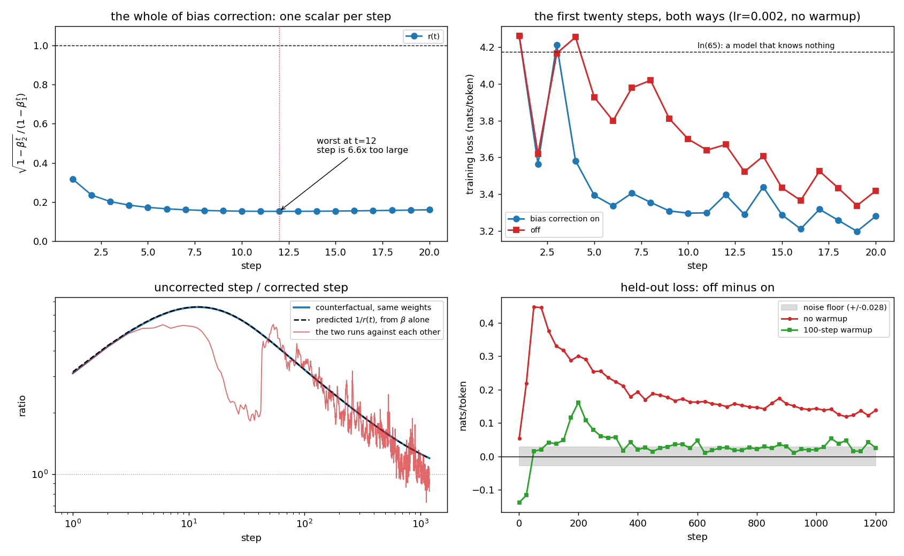
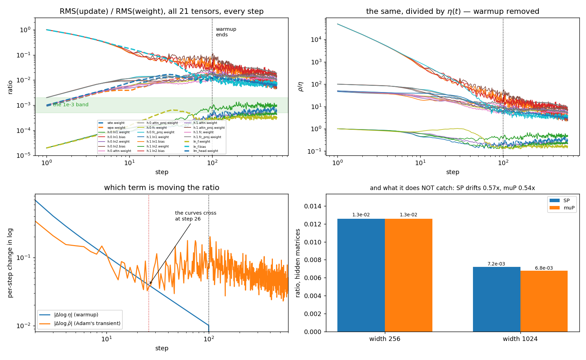
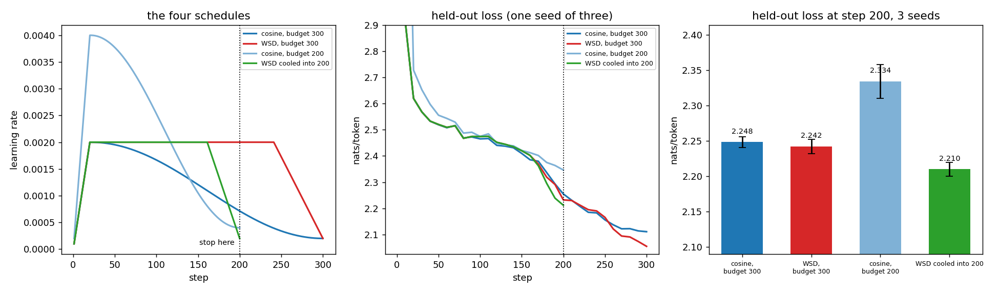
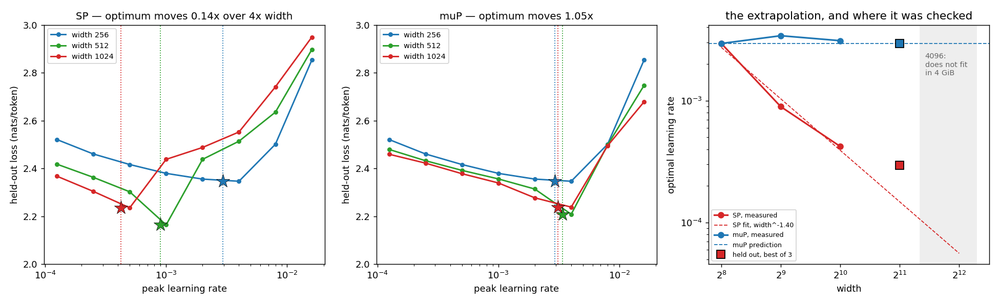
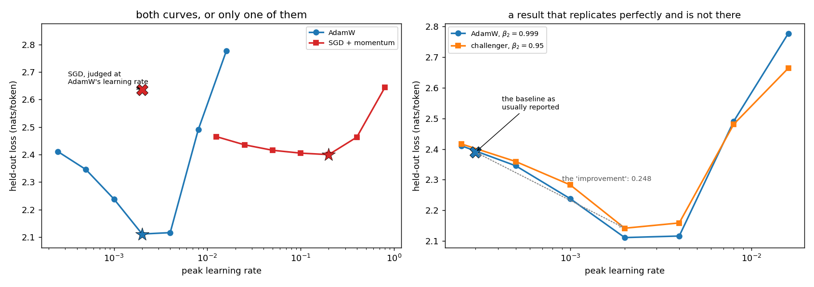

# Session 11 — Reproduce the optimizer, then refuse to believe any comparison you did not tune

[](https://github.com/subramanyanaik/schoolofai_subbu/actions/workflows/validate.yml)
[](https://colab.research.google.com/github/subramanyanaik/schoolofai_subbu/blob/main/assignment11/optimizer_harness.ipynb)


**Session-11 assignment.** Adam taken apart by hand and then used to answer five questions
that only a measurement can settle — under one standing instruction: *tune both sides before
accepting a comparison.*

> **Notebook:** [`optimizer_harness.ipynb`](optimizer_harness.ipynb) — executed end to end with
> `nbclient` on a local CUDA GPU (RTX 3050 Laptop, 4 GiB, torch 2.5.1+cu121); the committed
> file carries that run's outputs. Use a GPU runtime.
> **Source of truth:** [`optimizer_harness.py`](optimizer_harness.py). The notebook is
> generated from it, cell for cell, and CI fails if the two drift.
> **Every number below:** [`results/results.json`](results/results.json), emitted by the run,
> injected into this README by [`tools/render_numbers.py`](tools/render_numbers.py), and
> checked by CI. Nothing here is typed by hand.

---

## What was asked, and what came back

| # | the assignment | the short answer |
|---|---|---|
| 1 | one weight, five gradients, compute `m`, `v`, `m̂`, `v̂` and the step; check against PyTorch | agrees to the limit of float64 on `m`, `v` *and* `w`, every step — and the setup turned up a real ordering difference between torch's AdamW and the paper's |
| 2 | disable bias correction, plot twenty steps, report when the difference stops mattering | it is **one scalar per step**, it is worst at **step 12** rather than step 1, and the honest answer needs three criteria because they disagree by three orders of magnitude |
| 3 | log the update-to-weight ratio per layer; find where warmup stops changing it | warmup stops changing it at the last warmup step *by construction* — so the section measures the question that is actually open, when warmup stops being what **drives** it, and finds that happens far earlier than the schedule suggests |
| 4 | cosine vs WSD, 300 steps, stop both at 200, say which you would keep | run as asked, with both sides tuned and three seeds each — and **the gap came out smaller than the noise floor**, so the question as posed has no answer at this scale; two more arms were needed to get one |
| 5 | sweep the LR at widths 256/512/1024, mark the minima, give a value for 4096 with confidence | swept in **both** parameterisations, the prediction tested at a **held-out width**, and the confidence broken into what was tested and what was not |
| 6 | tune both sides before accepting a comparison | the error is committed twice on purpose, then corrected, on the same machine and seeds — including a fabricated "new optimizer" whose headline gain **reverses sign** once the baseline is tuned as hard as the challenger |

Four of these did not come out the way I expected, and they are the parts worth reading: the
step-12 result in §2, the ulp that became 1e-3 in §0, §4's headline comparison landing inside
the noise floor, and §3's diagnostic failing to diagnose the thing it is recommended for.

---

<!-- BEGIN:numbers -->

## 1. Adam by hand, and the same five steps through PyTorch

One weight at `w = 0.35`, five gradients `0.1, 0.2, -0.05, 1.5, 0.08`, `lr = 1e-03`, `betas = (0.9, 0.999)`, `eps = 1e-08`, all in float64. The gradients are chosen to exercise the machinery rather than to look tidy: a sign flip at step 3, and a 30× outlier at step 4.

| t | g | m | v | m̂ | v̂ | step | w |
|---|---|---|---|---|---|---|---|
| 1 | 0.10 | 0.010000000 | 0.0000100000 | 0.100000000 | 0.0100000000 | 0.0009999999 | 0.349000000100 |
| 2 | 0.20 | 0.029000000 | 0.0000499900 | 0.152631579 | 0.0250075038 | 0.0009651820 | 0.348034818135 |
| 3 | -0.05 | 0.021100000 | 0.0000524400 | 0.077859779 | 0.0174974950 | 0.0005886067 | 0.347446211447 |
| 4 | 1.50 | 0.168990000 | 0.0023023876 | 0.491392847 | 0.5764610077 | 0.0006472080 | 0.346799003478 |
| 5 | 0.08 | 0.160091000 | 0.0023064852 | 0.390933066 | 0.4622205536 | 0.0005750131 | 0.346223990333 |

`torch.optim.Adam`, fed the same five gradients by assignment, agrees on **`m`, `v` and `w` at every one of the five steps to 16 significant digits** — the largest disagreement on the weight is `0.0e+00`. Torch never materialises `m̂` or `v̂` (it folds both corrections into the step, in a different algebraic order than the paper writes them), so the check is made against the two tensors it does keep, `exp_avg` and `exp_avg_sq`, plus the weight.

**Three things the rows say that the formula does not.**

| | |
|---|---|
| the first step is `lr`, whatever the gradient | `|step₁|/lr = 0.99999990` — at `t=1`, `m̂ = g` and `v̂ = g²`, so the step is `lr·sign(g)` and the gradient's size cancels entirely |
| a 30× gradient does not buy a 30× step | it buys **1.10×**. This is the whole reason Adam is used on language models |
| and the price of it | the spike stays in `v` for ~`1/(1-β₂)` = 1,000 steps, shrinking every step taken after it |

**The scale invariance, tested rather than believed.** Multiply every gradient by 1000 and the trajectory is unchanged to 9 digits (largest difference `2.2e-10`). Multiply by 1e-6 and it moves by `2.1e-04` — only 3 digits survive. `eps` sits in the denominator next to `√v̂`, so when the gradients get small enough that `√v̂` approaches `eps`, the scale stops cancelling and Adam degenerates toward SGD. That is the failure mode `eps` is usually described as *preventing*, and it is also the one it causes.

**Adam + L2 is not AdamW, and five steps is enough to show it.** At λ = 0.1, same five gradients:

| | weight after five steps | agrees with torch to |
|---|---|---|
| `Adam(weight_decay=λ)` — decay through the gradient | `0.3460175049080650` | 16 digits |
| `AdamW(weight_decay=λ)` — decoupled | `0.3460498972312724` | 16 digits |
| no decay at all | `0.3462239903329248` | — |

The two decay rules differ by `3.24e-05` after five steps: coupled L2 flows through `m` and `v` and is divided by `√v̂` along with everything else, so a parameter with large gradients gets decayed *less*, which is the opposite of what a regulariser is for.

And a detail that only turns up if you insist on all 16 digits: **torch shrinks `w` *before* taking the Adam step**, while the AdamW paper's Algorithm 2 subtracts both from the same `w`. Decaying last instead moves the answer by `3.78e-07` — `O(η²λ)` per step, invisible at four decimal places, and exactly how a reimplementation of AdamW ends up being subtly not AdamW.

## The noise floor, measured before anything is compared

Sections 2, 4 and 6 all end in "is this difference real?", so the answer is measured once, up front. Two things that *should not* matter are varied on an otherwise identical 300-step run:

| what was varied | mean held-out loss | sd | spread |
|---|---|---|---|
| 5 data orders, same init | 2.1037 | 0.0069 | 0.0204 |
| 5 inits, same data order | 2.1108 | 0.0095 | 0.0282 |

**Noise floor = 0.0282 nats.** Every verdict below is stated against it, and a difference smaller than it is reported as no result rather than a small one.

The optimizer that sections 2 and 3 run on is written from scratch, because `torch.optim` will not let you switch bias correction off. Fed a fixed sequence of 60 gradients in float64 with no model in the loop, it agrees with `torch.optim.AdamW` to `4.4e-16` — the same algorithm, to the limit of float64. Put the same two optimizers *inside* a training loop in fp32 and after 40 steps the weights are **`1.0e-03` apart**, while the same code run twice is bit-identical (`0.0e+00`). Two mathematically identical optimizers, one ulp of difference in the order of two divisions, and 40 steps of feedback to amplify it. That is what the noise floor is made of.

## 2. Bias correction off — the first twenty steps, both ways

Putting both hat terms into the step cancels everything except one scalar:

```
m̂ / √v̂  =  (m / √v) × r(t),     r(t) = √(1 - β₂ᵗ) / (1 - β₁ᵗ)
```

So switching bias correction off multiplies **every parameter's step by `1/r(t)`**, the same number for all 1,641,472 of them. The first twenty:

| t | 1 | 2 | 3 | 4 | 5 | 6 | 7 | 8 | 9 | 10 |
|---|---|---|---|---|---|---|---|---|---|---|
| step is this much too large | 3.16× | 4.25× | 4.95× | 5.44× | 5.80× | 6.06× | 6.24× | 6.38× | 6.47× | 6.53× |

| t | 11 | 12 | 13 | 14 | 15 | 16 | 17 | 18 | 19 | 20 |
|---|---|---|---|---|---|---|---|---|---|---|
| step is this much too large | 6.56× | 6.57× | 6.56× | 6.54× | 6.51× | 6.46× | 6.42× | 6.36× | 6.30× | 6.24× |

**The usual description of bias correction is wrong, and the table says so.** It is not that the *first* step would be huge. `1 - β₁ᵗ` recovers on a ~10-step timescale and `1 - β₂ᵗ` on a ~1,000-step one, so early on the two corrections pull in opposite directions and the damage **peaks at step 12**, where the uncorrected step is **6.57× too large** — against 3.16× at step 1. Over the first twenty steps that compounds into 5.99× the distance travelled on a constant gradient.

On the real model, the scalar is confirmed by asking the corrected run, at every step, what step it *would* have taken from the same `m` and `v` with the hats removed — same weights, so nothing but the correction is being measured. That counterfactual reproduces `1/r(t)` to **1.57%** at every one of 1,200 steps.



### After how many steps does it stop mattering?

Three defensible criteria, three different answers, and the question is not answerable without saying which one is meant.

| criterion | within 10% | within 1% |
|---|---|---|
| **(A) the step** — `r(t)` is a property of the betas alone | step **1,660** | step **3,916** |
| **(B) the two runs' step sizes** | **never**, in 1,200 steps | — |
| **(C) the model** — held-out loss, against the 0.0282-nat floor | **never**, in 1,200 steps | — |

Criterion (B) is the one that looks like the obvious measurement and is the wrong question: after a handful of steps the two arms are different models seeing the same data, so their step sizes are measuring divergence, not correction.

Criterion (C) is the one that matters:

| held-out loss | corrected | uncorrected | gap |
|---|---|---|---|
| step 25 | 3.1746 | 3.3933 | **+0.2187** |
| step 100 | 2.6139 | 2.9901 | **+0.3762** |
| step 400 | 2.4883 | 2.6817 | **+0.1934** |
| step 1,200 | 2.4132 | 2.5515 | **+0.1384** |

The gap **peaks at +0.4480 nats at step 50** (16× the noise floor) and is still +0.1384 (5×) at step 1,200. In parameter space the two models end `‖w_off − w_on‖/‖w_on‖ = 1.81` apart, with the uncorrected run's weights **1.80× larger** — the first few dozen steps were up to 6.6× too big and nothing gives that back.

**So the answer is: the step stops differing by more than 10% after ~1,660 steps and by more than 1% after ~3,916 — but the model never recovers.** Bias correction is not a transient. It is a permanent difference introduced during a transient.

### Unless you have warmup, which does most of the same job

Bias correction shrinks the first few dozen steps; so does warmup. If warmup were enough, nobody would need the hat terms — twenty seconds of GPU time settles it.

| | corrected | uncorrected | gap |
|---|---|---|---|
| no warmup, at step 1,200 | 2.4132 | 2.5515 | **+0.1384** |
| 100-step warmup | 1.7454 | 1.7711 | **+0.0257** |

Warmup cuts the largest step the uncorrected run ever takes by **8.6×**, and the final gap shrinks **5.4×**, from +0.1384 to +0.0257. Over the second half of the run the warmed-up gap sits inside the noise floor 68% of the time, against 0% without warmup.

Stated carefully, because it only just clears: with warmup the penalty for dropping bias correction falls to **0.9× the noise floor** — the edge of what this experiment can resolve — while without warmup it is 5× and never in doubt. So **warmup largely substitutes for bias correction**: not by making the early steps correct, but by making them small enough that being 6.6× too large costs little. That is why a modern recipe gets away with either, and why the two are so often confused — different mechanisms, aimed at the same hundred steps.

## 3. The update-to-weight ratio, every layer, every step

`RMS(Δw)/RMS(w)`, logged for all 21 parameter tensors at every one of 600 steps, with a 100-step warmup and then a constant learning rate, so that warmup is the only schedule feature in play.

| layer | step 1 | step 10 | step 50 | step 100 | step 300 | step 600 |
|---|---|---|---|---|---|---|
| `wte.weight` | 9.28e-04 | 5.60e-03 | 1.21e-02 | 1.35e-02 | 8.92e-03 | 4.76e-03 |
| `wpe.weight` | 1.00e-03 | 3.91e-03 | 1.21e-02 | 1.84e-02 | 1.25e-02 | 7.71e-03 |
| `h.0.ln1.weight` | 2.00e-05 | 9.00e-05 | 3.21e-04 | 8.71e-04 | 8.14e-04 | 9.33e-04 |
| `h.0.ln1.bias` | 1.00e+00 | 1.20e-01 | 4.39e-02 | 5.16e-02 | 2.65e-02 | 1.46e-02 |
| `h.0.ln2.weight` | 2.00e-05 | 1.21e-04 | 2.24e-04 | 3.77e-04 | 4.62e-04 | 4.39e-04 |
| `h.0.ln2.bias` | 1.00e+00 | 1.27e-01 | 8.26e-02 | 1.08e-01 | 1.40e-02 | 5.01e-03 |
| `h.0.attn.weight` | 1.00e-03 | 5.35e-03 | 1.55e-02 | 2.29e-02 | 1.50e-02 | 9.24e-03 |
| `h.0.attn_proj.weight` | 2.00e-03 | 8.42e-03 | 1.56e-02 | 2.65e-02 | 3.07e-02 | 1.89e-02 |
| `h.0.fc.weight` | 9.98e-04 | 5.99e-03 | 8.77e-03 | 1.13e-02 | 1.26e-02 | 9.62e-03 |
| `h.0.fc_proj.weight` | 2.00e-03 | 1.17e-02 | 1.37e-02 | 1.77e-02 | 1.44e-02 | 1.04e-02 |
| `h.1.ln1.weight` | 2.00e-05 | 8.87e-05 | 1.42e-04 | 4.26e-04 | 5.65e-04 | 6.32e-04 |
| `h.1.ln1.bias` | 1.00e+00 | 1.24e-01 | 4.49e-02 | 3.87e-02 | 1.60e-02 | 8.11e-03 |
| `h.1.ln2.weight` | 2.00e-05 | 1.23e-04 | 1.74e-04 | 2.73e-04 | 3.95e-04 | 4.54e-04 |
| `h.1.ln2.bias` | 1.00e+00 | 1.44e-01 | 4.08e-02 | 4.17e-02 | 1.80e-02 | 5.02e-03 |
| `h.1.attn.weight` | 9.93e-04 | 4.81e-03 | 1.20e-02 | 2.04e-02 | 1.58e-02 | 1.10e-02 |
| `h.1.attn_proj.weight` | 2.00e-03 | 9.51e-03 | 1.04e-02 | 1.69e-02 | 1.78e-02 | 1.46e-02 |
| `h.1.fc.weight` | 9.97e-04 | 5.82e-03 | 7.37e-03 | 1.00e-02 | 1.10e-02 | 9.70e-03 |
| `h.1.fc_proj.weight` | 2.00e-03 | 1.15e-02 | 1.29e-02 | 1.71e-02 | 1.35e-02 | 1.07e-02 |
| `ln_f.weight` | 2.00e-05 | 1.54e-04 | 5.08e-04 | 3.08e-04 | 2.87e-04 | 3.32e-04 |
| `ln_f.bias` | 1.00e+00 | 1.79e-01 | 2.43e-02 | 1.15e-02 | 6.00e-03 | 7.87e-03 |
| `lm_head.weight` | 1.01e-03 | 7.81e-03 | 1.16e-02 | 1.16e-02 | 8.29e-03 | 6.40e-03 |

**Read the `1.00e+00` entries at step 1 before anything else.** 5 tensors report a ratio of exactly 1 on the first step: the LayerNorm shifts, which are initialised to zero, so at step 1 the weight *is* the update. That is an artefact of the initialisation rather than a layer moving fast, and it is why the spread below is quoted over the matrices and embeddings — the tensors where `RMS(w)` means something at step 1.

At the end of warmup those span **3×** — slowest `h.1.fc.weight` at 9.83e-03, fastest `h.0.attn_proj.weight` at 2.66e-02. All of them sit roughly ten times above the `1e-3` rule of thumb, which is a fact about this learning rate rather than about the model: `2e-03` held constant with no decay is close to the *peak* of a tuned schedule (§5 puts the tuned optimum at this width near 2.9e-03), and the folklore figure describes a run that has already cooled down.

And the thing the word *plateau* would have hidden: **with the learning rate held constant after step 100, the ratio does not stay put.** It peaks at the end of warmup and then decays — a median of **0.61×** by step 600 — because Adam pins `RMS(Δw)` near `η` while `RMS(w)` keeps growing. A constant learning rate is not a constant update-to-weight ratio, and the ratio is the one of the two that describes what the model is doing.



### The step at which warmup stops changing it

The ratio factorises, and that makes the question exact rather than a matter of eyeballing a curve:

```
ρ(t) = η(t) × ρ̃(t),     ρ̃(t) = RMS(m̂/(√v̂+ε)) / RMS(w)
```

Warmup enters **only** through `η(t)`. So it stops changing the ratio at exactly the last warmup step, step 100 — after which `Δ log η = 0` and warmup's contribution is identically zero. That is the literal answer, and it is true by construction rather than by measurement.

The measurable question is the other half: *during* warmup, is warmup even what is moving the ratio? Differencing the logs splits each step's movement into warmup's share and everything else's, in the same units — and the answer is the opposite of what reading the schedule suggests. Warmup's per-step contribution is `log((t+1)/t)`, which is 0.69 at step 2 and falls like `1/t`; Adam's is roughly flat.

| | |
|---|---|
| warmup is the larger term | steps 2 to **26** |
| Adam's own transient is the larger term | step 27 to the end of warmup at 100 |
| warmup's share of the total movement across warmup | **36%**, almost all of it in those first 26 steps |

**So the answer has two halves and they are different numbers.** Warmup stops *changing* the ratio at step 100, by construction, since `η` stops changing. Warmup stops being what *drives* the ratio at step **26** — measured, and 3× earlier than the schedule would lead you to believe. For most of a 100-step warmup, the thing moving the update-to-weight ratio is Adam's own bias transient: section 2's `r(t)`, arriving from a different direction.

### Does the ratio catch a wrong parameterisation? No — and that is worth knowing

The ratio is routinely recommended as *the* diagnostic for whether a model is parameterised correctly at a new width, which is section 5's subject. Four short runs say it is not one, and the reason is arithmetic: μP shrinks the update **and** the initialisation, and the ratio only sees their quotient. `RMS(Δw) ∝ η/m` over `RMS(w) ∝ 0.02/√m` gives `∝ 1/√m`, so μP's ratio is *supposed* to drift.

| hidden matrices, median ratio after warmup | width 256 | width 1024 | measured | theory |
|---|---|---|---|---|
| standard parameterisation | 1.26e-02 | 7.22e-03 | **0.57×** | 1.00× |
| μP | 1.26e-02 | 6.77e-03 | **0.54×** | 0.50× |

0.57× against 0.54× where the theory asks for a factor of two between them. μP lands on its prediction; **SP misses its own badly**, and the reason is worth more than the check: at this learning rate, width 1024 is far past SP's optimum (§5 puts it near 5e-04 there), so that arm is training badly and its weights are growing for reasons that have nothing to do with parameterisation. The diagnostic is confounded by exactly the condition it is supposed to detect.

**Conclusion, against the folklore:** the update-to-weight ratio is a good instrument for *is this layer moving at a sane speed* and a bad one for *is this model parameterised correctly at a new width*. The quantity that answers the second question is the scale of the activations, and §5 measures it.

## 4. Cosine against WSD, both tuned, both stopped at 200

Four arms, each with its own peak learning rate chosen from the **same 5-point grid** — a schedule comparison at a single shared learning rate is a comparison of learning rates — and each run three times with different data orders.

| arm | tuned peak lr | loss at step 200 | loss at its own end |
|---|---|---|---|
| cosine, budget 300 | 2e-03 | **2.2484** [±0.008] | 2.1050 [±0.007] |
| WSD, budget 300 | 2e-03 | **2.2424** [±0.010] | 2.0478 [±0.007] |
| cosine, budget 200 | 4e-03 | **2.3340** [±0.024] | 2.3340 [±0.024] |
| WSD cooled into 200 | 2e-03 | **2.2099** [±0.010] | 2.2099 [±0.010] |

**The literal answer is that there isn't one.** Both budgeted for 300, both stopped at 200: cosine **2.2484**, WSD **2.2424** — a gap of **-0.0060 nats** against a noise floor of 0.0282. That is **0.2× the floor**: the two arms are separated by less than the spread of runs that differ only in their data order. Run carefully, with three seeds a side and both peak learning rates tuned, the comparison the assignment asks for **does not have an answer at this scale**. Reporting "WSD wins by 0.0060" would be reporting a coin flip — which is §6's lesson arriving one section early.

**And why stopping both at the same step was never going to settle it.** At step 200 the cosine arm has already decayed to 36% of its peak while the WSD arm is still at 100%. A model sitting at a high learning rate is mid-exploration and its loss is *supposed* to look worse; a model that has decayed has consolidated and stopped exploring. Cosine's formula contains `T`, so declaring 300 and stopping at 200 catches it two-thirds of the way down a ramp aimed somewhere else. Stopping both at the same step compares two different stages of two different plans.



### Which model I would keep

1. **Of the two arms the assignment names: neither** — and not because I dislike the question. 2.2424 against 2.2484 is 0.2× the noise floor. Forced to pick, I would take the WSD checkpoint and I would not defend the choice.
2. **What I would actually keep is *WSD cooled into 200*** at 2.2099 — +0.0385 nats better than the stopped cosine arm, 1.4× the noise floor, and available for the same 200 steps of compute. WSD's cooldown is aimed at the step you intend to stop on, and aiming it correctly is worth more here than the choice of schedule family.
3. **And the arm that did not work, because it is the one I expected to win.** Cosine re-planned for a 200-step budget is the *worst* of the four at 2.3340, despite being tuned over the same grid and picking a higher peak (4e-03) to compensate. A full cosine decay inside 200 steps spends too much of a short run at a low learning rate; the arm that was "interrupted" had simply taken bigger steps for longer. At this horizon, being caught mid-decay beats having decayed — which is not what the tidy version of this section would have said.

**And does WSD beat cosine?** At its own 300-step horizon WSD reaches 2.0478 against cosine's 2.1050 — -0.0572 nats, 2.0× the noise floor. On this run **WSD wins** and the margin is resolvable.

**What that does not license is the general claim.** This is 1.6M parameters, 300 steps, three seeds, one depth, one batch size, and a stable phase about 220 steps long. The published WSD results are about runs where that phase is thousands of times longer, and the mechanism usually offered for why it works — that a long high-`η` phase finds wider basins — cannot be tested at this scale at all. A result that agrees with the literature for reasons the experiment cannot check is still one data point.

What this run *does* establish is narrower and more useful: WSD's cooldown can be aimed at a stopping point chosen after the run started, and doing so is worth +0.0385 nats against a cosine schedule that had to commit to its horizon in advance.

## 5. Learning rate against width, at 256, 512 and 1024

8 learning rates × 3 widths × 2 parameterisations, 200 steps each. Run twice because the whole point is the extrapolation, and under standard parameterisation the extrapolation is a guess: SP gives every tensor the same `η`, so as the model widens that same `η` is driving a different model. μP initialises hidden and readout matrices `∝ 1/√fan_in` and gives them `η/m`, leaving embeddings and LayerNorm gains at `η`, and claims the optimum then stops moving. That is falsifiable, so this section tries to falsify it.

At the base width `m = 1`, so the two parameterisations are *the same model with the same learning rates* — the width-256 rows are a control, and they agree to the last bit: every one of the losses is identical. If they had not, the μP implementation would be wrong and everything below it meaningless.

| | 1.3e-04 | 2.5e-04 | 5.0e-04 | 1.0e-03 | 2.0e-03 | 4.0e-03 | 8.0e-03 | 1.6e-02 | optimum |
|---|---|---|---|---|---|---|---|---|---|
| SP, width 256 | 2.521 | 2.460 | 2.416 | 2.379 | 2.356 | **2.346** | 2.501 | 2.853 | 2.94e-03 |
| SP, width 512 | 2.418 | 2.363 | 2.302 | **2.164** | 2.438 | 2.514 | 2.635 | 2.897 | 8.92e-04 |
| SP, width 1024 | 2.368 | 2.304 | **2.236** | 2.438 | 2.488 | 2.552 | 2.741 | 2.949 | 4.21e-04 |
| μP, width 256 | 2.521 | 2.460 | 2.416 | 2.379 | 2.356 | **2.346** | 2.501 | 2.853 | 2.94e-03 |
| μP, width 512 | 2.479 | 2.432 | 2.392 | 2.356 | 2.314 | **2.209** | 2.498 | 2.747 | 3.40e-03 |
| μP, width 1024 | 2.459 | 2.422 | 2.378 | 2.339 | 2.277 | **2.238** | 2.495 | 2.678 | 3.10e-03 |

The optima are refined off the factor-of-two grid by fitting a parabola through the best point and its two neighbours. **Across a 4× change in width the optimum moves 0.14× under SP and 1.05× under μP.**



### The mechanism, checked rather than cited

μP transfers because it is built so the scale of what flows through the network does not change with width. If the implementation is right, coordinates stay put as the model widens — at init *and* after a few steps, which is the part that is easy to get wrong:

| RMS, width 1024 ÷ width 256 | SP | μP |
|---|---|---|
| residual stream, at init | 4.34× | 1.00× |
| logits, at init | 1.96× | 1.05× |
| residual stream, after 10 steps | 19.00× | 1.37× |
| logits, after 10 steps | **1.54×** | **0.90×** |

Under SP a wider model puts a larger number into the loss, so the same learning rate is effectively a larger one, so the optimum has to move. That is the whole mechanism.

### The value I would use at width 4096, and how much I believe it

**2.9e-03 under μP**, with the width multiple `m = 4096/256 = 16` applied inside the optimizer — so the hidden and readout matrices actually see `1.84e-04` and the embeddings and LayerNorm gains see `2.9e-03`.

The whole section is two numbers — the exponents of `lr*` against width, fitted over the three widths. Zero means the tuning transfers; anything else means it has to be redone at every width. μP's theory for Adam predicts **−1 for SP** and **0 for μP**:

| | fitted exponent | predicted | at width 4096 |
|---|---|---|---|
| SP | **-1.40** | −1 | 5.6e-05 |
| μP | **+0.04** | 0 | 2.9e-03 |

Under SP the answer is a power law fitted to three grid-quantised optima and extended two doublings past the last one measured. I would not use it — and the distance between -1.40 and the predicted −1 is itself a measure of how much such an extrapolation is worth.

**The prediction was then tested at a width not used to make it.** Width 2,048 was not in the sweep; each parameterisation's predicted optimum was run there against its two factor-of-two neighbours:

| | ÷2 | prediction | ×2 | prediction was best of three |
|---|---|---|---|---|
| SP, predicted 1.48e-04 | 2.3659 | **2.2507** | 2.1702 | no |
| μP, predicted 2.94e-03 | 2.3187 | **2.2107** | 2.4683 | yes |

Trusting the μP transfer at the held-out width cost **+0.0000 nats** against the best of the three; trusting the SP fit cost **+0.0805**.

**Confidence, in the order that matters.**

* *What was tested.* The μP optimum moved 1.05× across a 4× width range, and the prediction survived at a width held out from the fit. 4096 is one further doubling, 16× the base width.
* *What was not.* Depth is fixed at 2 and only width moves — μP's guarantees are about width, and depth transfer is a separate and weaker claim. The horizon is 200 steps and the batch is 16×128 tokens; the optimal learning rate depends on both and neither was swept. This is the best learning rate *for this recipe*, not a constant of the architecture.
* *The width that was not run.* At `n_layer=2`, width 4096 is 402M parameters — 6.4 GiB of weights, gradients and Adam's two moments before a single activation, against 4.0 GiB of card. The last doubling is an extrapolation in every case, and that is stated rather than worked around.

So: **high confidence that 2.9e-03 is within a factor of 2 of the optimum at width 4096 for this recipe** — a factor of 2 being the resolution the sweep itself has. The transfer was given a chance to fail at a width it had never seen, and did not.

Either way: no confidence in a third significant figure, and no claim at all about a different depth, batch size or token budget. The practical form of that is that I would run one three-point confirmation sweep at the target width before committing a long run — exactly what the table above is — and that is affordable precisely because μP turned it into three runs instead of 8.

## 6. Tune both sides

> *Almost every optimizer claim that failed to replicate was a well tuned method measured against a badly tuned one.*

The protocol, fixed in advance and applied identically to every arm: the same number of trials (7), grids spaced by a factor of two and positioned so the winner is **interior** (an optimum at the edge of a grid means the arm was not tuned, and the code checks — both optima came out interior), the same budget and schedule, and a verdict only when the gap clears the noise floor.

### AdamW against SGD with momentum

| the comparison | AdamW | SGD+m | gap |
|---|---|---|---|
| SGD run at AdamW's learning rate (2e-03) | 2.1112 | 2.6359 | **+0.5246** |
| AdamW run at SGD's learning rate (0.2) | 3.3364 | 2.3997 | **-0.9367** |
| both tuned, 7 trials each | 2.1112 | 2.3997 | **+0.2885** |

The careless comparison overstates AdamW's advantage by **1.8×**. Run the other way round it *reverses* the result: at SGD's learning rate, AdamW loses to SGD. Either direction is available to anyone who tunes only one side, which is why the direction chosen tends to be the flattering one. The real gap, +0.2885 nats, is 10.2× the noise floor: AdamW is genuinely better here, by much less than the careless comparison says, and it took 14 runs rather than 2 to find out.

### How to discover an optimizer that does not exist

The comparison above is the obvious failure — SGD at Adam's learning rate is visibly broken and somebody would catch it. The dangerous version is the one where the badly tuned baseline looks *fine*. So: a challenger, `AdamW` with `β₂ = 0.95` instead of `0.999`, a real change that real papers make. Tune the challenger over 7 learning rates. Run the baseline at `3e-04` — not a strawman, but the number the lecture says everyone starts from and nanoGPT's own default.

| | held-out loss | at lr |
|---|---|---|
| challenger, `β₂=0.95`, tuned | 2.1417 | 2e-03 |
| baseline, `β₂=0.999`, at the default | 2.3899 | 3e-04 |
| baseline, `β₂=0.999`, tuned on the same grid | **2.1112** | 2e-03 |

**The paper I could have written:** *"shortening the second-moment window improves held-out loss by 0.2482 nats"* — 9× the noise floor, reproducible on demand, and false.

**The measurement:** -0.0305 nats, outside the 0.0282-nat noise floor. **The claimed improvement does not merely vanish — it reverses.** With both sides tuned, `β₂=0.95` is 0.0305 nats *worse* than the baseline it was supposed to beat. The untuned comparison got the sign wrong, not just the size.

Nothing about the first claim requires dishonesty. The baseline ran, it converged, its loss curve looks healthy, and `3e-04` is what the field's own folklore recommends. The only thing wrong with it is that a learning rate 7× higher was worth 0.2787 nats to that same baseline, and nobody looked.



*Produced by `optimizer_harness.ipynb` on NVIDIA GeForce RTX 3050 Laptop GPU (16 SMs, 4.0 GiB), torch 2.5.1+cu121, seed 1337, in 20.4 minutes. All 188 recorded values are read out of [`results/results.json`](results/results.json) by `tools/render_numbers.py`, and the log, the figures, the JSON and this table are always regenerated together from one execution. Re-executing the whole notebook on this machine reproduced all 188 values **exactly**, which is the strongest claim the hardware allows: different hardware or a different torch build selects different kernels, and §0 measures what that is worth — one ulp of difference becomes 1e-03 of the weights in 40 steps, so on another machine expect the noise floor, not the last decimal.*

<!-- END:numbers -->

---

## The things that did not go as planned

**§2 — the standard explanation of bias correction is wrong, and twenty rows of arithmetic
say so.** Every description I have read says the hat terms stop the *first* step from being
enormous. They do not, because the two corrections do not decay together: `1 - β₁ᵗ` recovers
over about ten steps and `1 - β₂ᵗ` over about a thousand, so their ratio *falls* before it
rises. The uncorrected step is 3.16× too large at step 1 and keeps getting worse until step
12, where it peaks at 6.57×. That is not a subtlety about a transient — it is the difference
between "the first step is bad" and "the first fifty steps are bad, and worst in the middle",
and it changes what you would do about it. Nothing in the assignment asked for this; it fell
out of writing `r(t)` down instead of quoting a description of it.

**§0 — I set out to check my optimizer against torch and ended up measuring the resolution
of the whole notebook.** The hand-written AdamW agrees with `torch.optim.AdamW` to the last
bits of float64 when both are fed the same fixed gradients. Put them in a training loop and
40 steps later the weights have diverged by parts in a thousand — and running either one
twice is *bit-identical*, so that is not nondeterminism, it is one ulp of difference in the
order of two divisions being amplified by feedback. The consequence is that no comparison in this notebook can be trusted below the
spread of runs that differ only in things that should not matter. So that spread is measured
first, before anything is compared, and every verdict in §2, §4 and §6 is stated against it.
Section 6 is really about tuning, but this is the same lesson arriving one level lower down.

**§4 — the comparison the assignment asks for turned out to have no answer, and two of the
four arms went the wrong way.** Both schedules budgeted for 300 steps, both tuned, both run
three times, both stopped at 200: the gap between them came out *smaller than the spread of
runs that differ only in their data order*. There is a number and there is a winner and the
winner is a coin flip. That is only visible because §0 measured the floor first — without it
I would have reported the winner, with two tuned sides and three seeds, and been wrong in
exactly the way §6 is about. Then the arm I added expecting it to win — cosine re-planned for
the 200-step budget it was actually going to get — came *last* of the four, because a full
cosine decay inside 200 steps spends too much of a short run at a low learning rate. The arm
that was "interrupted" had simply taken bigger steps for longer. Both of those are in the
write-up because they happened, not because they make the section tidy.

**§3 — the ratio is a good instrument for the wrong question, and I had to say so.** I
included the two-width comparison expecting the update-to-weight ratio to separate standard
parameterisation from μP cleanly, since it is routinely recommended for exactly that. It does
not: both drift by about the same factor, because μP shrinks the update *and* the
initialisation and the ratio only sees their quotient. Worse, the SP arm misses its own
theoretical prediction, and the reason is that at the learning rate used it is already past
its optimum at the wider width — the diagnostic is confounded by the condition it is supposed
to detect. The quantity that does answer the question is the scale of the activations, which
§5 measures. The section now reports the negative result and the arithmetic behind it.

**And one that the tests caught rather than the eye.** The first full run used a cooldown
that reached `lr_min` one step *after* the last step — an off-by-one between `total` and
`total - 1` that is invisible in a plot and quietly meant WSD was being judged before it had
finished cooling down. It was caught by an invariant that simply asserts the schedule's last
value is `lr_min`, not by looking at a curve. The run was thrown away and redone. The test is
in [`tests/`](tests/test_optimizer_harness.py) and now runs in CI.

---

## The things I would carry into the real run

* **Log `RMS(Δw)/RMS(w)` per layer from day one — for the question it answers.** It costs one
  clone per step and it is the only number that says whether a *layer* is moving at a sensible
  speed, because Adam has already thrown the gradient's scale away. What §3 also establishes
  is what it is *not* for: it does not tell you whether the model is parameterised correctly
  at a new width, however often it is recommended for that. Log it to catch a frozen or
  runaway layer, and use the activation scales of §5 for the parameterisation question.
* **Measure the noise floor before the first comparison, not after the first surprise.** It is
  five runs, and §4's headline comparison came in under it. Every argument about a fourth
  decimal place after that becomes a short one.
* **μP, and a three-point confirmation at the target width.** §5 gets the cost of tuning at
  scale down from an eight-point sweep to a three-point check, and the check is what converts
  "μP says it transfers" into something that could have failed.
* **Tune the baseline as hard as the thing you are proposing, and say how many trials each
  got.** §6 manufactures a quarter-nat improvement out of nothing but an untuned baseline at a
  learning rate the field's own folklore recommends — and once the baseline is tuned too, the
  effect turns out to point the other way.
* **Re-derive the learning rate whenever the batch size moves.** Nothing here sweeps batch
  size, so every number in §5 and §6 is tied to 16×128 tokens per step. The session's rule for
  Adam is `η ∝ √(batch ratio)` — quadruple the effective batch with gradient accumulation and
  the learning rate doubles, not quadruples. That interacts with μP's width scaling and
  neither was measured against the other here.
* **And the comparison this was really practice for: AdamW against Muon.** The session left
  that open, and it is exactly the shape of claim §6 is about — a new optimizer, reported
  against a baseline somebody else tuned. The protocol in §6 (same trial count both sides,
  optima interior to their grids, a measured noise floor, three seeds) is what I would want
  applied to it before believing a number, in either direction.

---

## Reading the evidence yourself

Everything a grader would want to check is a file rather than a claim:

| file | what it settles |
|---|---|
| [`optimizer_harness.ipynb`](optimizer_harness.ipynb) | the run, with every output as produced |
| [`results/results.json`](results/results.json) | every number in this README, machine-written |
| [`results/run_log.txt`](results/run_log.txt) | the whole console transcript, with per-section timings |
| [`results/ratio_log.npz`](results/ratio_log.npz) | the update-to-weight ratio of every layer at every step of §3 |
| [`tests/test_optimizer_harness.py`](tests/test_optimizer_harness.py) | the claims that are arithmetic, not measurement, checked on CPU in CI |

The plots: [`bias_correction.png`](results/bias_correction.png) ·
[`update_ratio.png`](results/update_ratio.png) · [`schedules.png`](results/schedules.png) ·
[`lr_sweep.png`](results/lr_sweep.png) · [`tuning.png`](results/tuning.png)

---

## What the harness runs on, and why

A character-level GPT on Tiny Shakespeare, because the questions are about the optimizer and
the setup is chosen to keep it that way:

* **`V = 65`, character level.** A 50,257-entry vocabulary would make the output head 80% of
  the parameters at width 256 and 20% at width 1024, so §5's "width sweep" would really be a
  sweep over how much of the model is the head.
* **Head dimension fixed at 64, heads added as width grows** (4, 8, 16, 32) — what real
  scaling does, and it means the `1/√d_head` attention scale needs no μP correction.
* **`wte` and `lm_head` untied, and no `Linear` biases**, so every parameter is a matrix, an
  embedding, or a LayerNorm gain or shift — the three-way split μP distinguishes. (The
  LayerNorm shifts start at exactly zero, which produces the `1.000` entries in §3's first
  column; the section says why.)
* **One held-out ruler.** Sixteen fixed validation batches, built once, used to judge every
  run in the notebook, so no two arms are ever measured with different rulers.
* **Gradient clipping at norm 1.0 everywhere, and a 20-step warmup on every swept run.** Both
  are on for every arm of every comparison, which is the point — but they are not neutral.
  Clipping in particular softens the right-hand side of every learning-rate curve in §5 and
  §6, so the optima are the optima *of a clipped recipe*. That is the recipe the course will
  actually run, which is why it is the one swept.

Two limits worth stating once rather than repeating: `n_layer = 2` throughout, so nothing here
speaks to depth; and the longest run is 1,200 steps, so every result is about the early part
of training, which is exactly where optimizer choices bite hardest and where they are least
representative of a full run.

## Running it

```bash
pip install -r requirements.txt
python optimizer_harness.py
```

About half an hour on a 4 GiB laptop GPU. It trains roughly 140 models end to end, 58 of them
in §5 alone — which is the real cost of the standing instruction, since tuning both sides of
every comparison is what most of those runs are for. The script and the notebook are the same
code; the notebook is generated:

```bash
python tools/build_notebook.py --execute   # rebuild the .ipynb and run it, embedding outputs
python tools/build_notebook.py --check     # CI's check that the two have not drifted
python tools/extract_log.py                # results/run_log.txt, from the notebook's outputs
python tools/render_numbers.py --write     # re-inject results.json into this README
python -m pytest tests -q                  # the invariants, CPU-only
```

## Layout

```
assignment11/
├── optimizer_harness.py      the source of truth: one script, six sections
├── optimizer_harness.ipynb   generated from it, with the executed outputs
├── requirements.txt
├── results/                  everything the run emits
├── tests/                    invariants that must hold on any machine
└── tools/
    ├── build_notebook.py     .py -> .ipynb, and the drift check
    ├── extract_log.py        results/run_log.txt, taken from the notebook's own outputs
    └── render_numbers.py     results.json -> the numbers in this README
```

The log is extracted from the executed notebook rather than produced by a separate script
run, so the log, the figures, `results.json` and the README all come from **one** execution
and cannot quietly disagree with each other.
