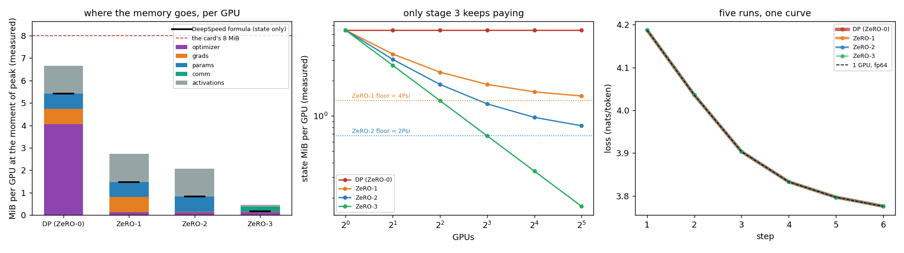
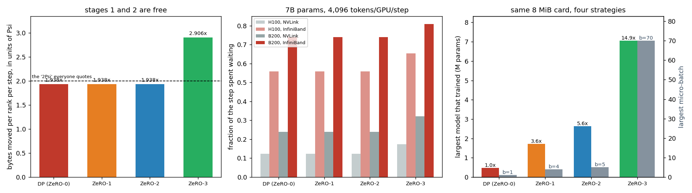

# Session 12 — 32 virtual GPUs, and what ZeRO actually costs

[](https://github.com/subramanyanaik/schoolofai_subbu/actions/workflows/validate.yml)
[](https://colab.research.google.com/github/subramanyanaik/schoolofai_subbu/blob/main/assignment12/zero_harness.ipynb)


**Session-12 assignment.** Build 32 virtual GPUs, run a model on them, simulate ZeRO-1,
ZeRO-2 and ZeRO-3, and show how memory and computation change.

> **Notebook:** [`zero_harness.ipynb`](zero_harness.ipynb) — executed end to end with
> `nbclient` on CPU (16 cores, torch 2.5.1); the committed file carries that run's outputs.
> A CPU runtime is correct here: the thing being measured is 32 replicas of a model, and 32
> replicas do not fit on one GPU.
> **Source of truth:** [`zero_harness.py`](zero_harness.py). The notebook is generated from
> it, cell for cell, and CI fails if the two drift.
> **Every number below:** [`results/results.json`](results/results.json), emitted by the run,
> injected into this README by [`tools/render_numbers.py`](tools/render_numbers.py), and
> checked by CI. Nothing here is typed by hand.

---

## The one-paragraph version

There is an easy way to do this assignment and it is worth naming, because avoiding it is
the whole design. The easy way is to type the DeepSpeed formulas — `16Ψ`, `4Ψ + 12Ψ/N`,
`2Ψ + 14Ψ/N`, `16Ψ/N` — into a spreadsheet, print a table and call it a simulation. That
version cannot be wrong, because it never touches anything, and it teaches nothing. So
instead: the 32 GPUs are objects with a **hard memory ceiling** and every tensor they own is
allocated through a ledger that refuses what does not fit; the collectives are **real ring
algorithms** run across 32 threads with a barrier per ring step and the bytes counted at the
hop; the gradients are **real gradients** from a real GPT trained on real text; and all four
strategies are checked, weight by weight, against a single GPU that shards nothing. The
formulas then show up as a *result* rather than an input — and in four places the
measurement says something the formula does not.

---

## What was asked, and what came back

| # | the assignment | the short answer |
|---|---|---|
| 1 | build 32 virtual GPUs | 4 nodes × 8, an 8 MiB hard ceiling each, NVLink inside a node and InfiniBand between — and ring collectives written out properly, which is where two of the findings come from |
| 2 | a demo model that runs on them | a 3-block GPT on character Shakespeare, written *functionally* so the same forward runs on owned weights (DDP) and on weights gathered from shards (ZeRO-3) |
| 3 | simulate ZeRO-1, ZeRO-2, ZeRO-3 | implemented, not costed: ZeRO-2 reduce-scatters from a hook that fires *during* the backward, ZeRO-3 gathers each block through a real `autograd.Function` and throws it away again |
| 4 | show how the memory changes | measured off the ledgers — and the DeepSpeed formula is reproduced to **0.000%**, which is the strongest evidence that the implementation is the real thing |
| 5 | show how the computation changes | two separate things, and they move in opposite directions: **communication** is unchanged for ZeRO-1/2 and 1.5× for ZeRO-3, while the **redundant optimizer arithmetic** — 32 ranks computing the same Adam update — is deleted outright by ZeRO-1. The forward and backward FLOPs never change at all, which is the point |
| 6 | "ask it to make sure it matches what ZeRO does" | all four stages reproduce a single-GPU run to ~14 digits in float64, and the session's own 30B/447 GiB table falls out of the measured bytes-per-parameter |

**The four results I did not expect, and the parts worth reading:**

1. **ZeRO-3's peak is not `16Ψ/N`.** The gathered bucket — the full copy of one block a rank
   must rebuild before it can multiply anything by it — came out *larger than everything
   ZeRO-3 stores permanently*, and it does not shrink when you add GPUs. The term everyone
   quotes is the one that stopped mattering.
2. **ZeRO-1 and ZeRO-2 are free.** I expected a memory-for-bandwidth trade and there isn't
   one: the byte counter reports the identical volume as plain data parallelism, to the
   last byte.
3. **An all-reduce does not move `2Ψ`.** It moves `2Ψ(N−1)/N`. Small, but it falls out of
   actually implementing the ring, and it is the difference between knowing the formula and
   knowing where it comes from.
4. **Nothing in ZeRO touches activations**, and at the batch sizes where these runs actually
   die, activations are most of the card. Past a point, more ZeRO buys nothing and the next
   win is on a different axis entirely.

<!-- BEGIN:numbers -->

## 1. The 32 virtual GPUs, and a fabric that had to prove itself first

`32` GPUs as `4` nodes of `8`, because that is the shape of the hardware being modelled: NVLink at **450 GB/s** inside a box, InfiniBand at **50 GB/s** between them — **9× slower**, which is the fact the whole second half of this turns on.

Each GPU is a rank, a node, and a **memory ledger with a hard ceiling of 8 MiB**. Every tensor a rank owns is created through `mem.alloc(...)`, which adds the tensor's true byte count — asked of the tensor, not assumed — to a running total, updates a high-water mark, and raises `DeviceOOM` when the rank has run out of room. That ceiling is the most important design decision here: it is what turns *"ZeRO-3 fits a bigger model"* from a claim into an experiment, and §7 grows the model until each stage hits it.

The ceiling is 8 MiB rather than 80 GiB because 32 replicas of an 80 GiB-class model is several terabytes and this laptop has 16 GB. Every card is scaled down by one factor of **10,240** and nothing else is touched — the bandwidths are the real ones, and every quantity ZeRO is about is a ratio, so it survives the scaling exactly. §10 pushes a measurement back up and checks it against a number that was not produced here.

### Why the collectives are implemented and not costed

Three collectives carry all of data parallelism:

| | what it does | who ends up with what |
|---|---|---|
| **all-reduce** | combines a value from every GPU | *every* GPU gets the whole combined result |
| **reduce-scatter** | combines it the same way | every GPU gets **one slice** — 1/32 each |
| **all-gather** | the reverse | every GPU contributes its slice and leaves with the whole thing |

and the identity everything else rests on:

> **all-reduce = reduce-scatter + all-gather.**

That is not a coincidence, it is how a ring all-reduce is *built*. Which means plain data parallelism was always paying for both halves — and ZeRO-1 and ZeRO-2 get their memory back **for free** by noticing that there is a moment between the two halves when every rank is holding exactly its own slice of the reduced gradient and nothing else. Everything those two stages do happens in that gap. This is the single most useful idea in the session, and it is why §5 comes out the way it does.

So the ring is written out: `2(N−1)` steps of `Ψ/N` bytes, a barrier per step, a real copy at each hop, and the byte counter incrementing where a chunk crosses from rank `r` to rank `r+1`. Four checks before any of it is used:

| check | result |
|---|---|
| ring all-reduce vs a naive sum over 32 ranks | agrees to **15.3 digits** (`1.1e-14` absolute) |
| reduce-scatter, reassembled | `1.1e-14` |
| bytes per rank, measured at the hop | **1.9375×Ψ** |
| bytes per rank, the ring's own theory `2Ψ(N−1)/N` | **1.9375×Ψ** |
| hops, measured / `N·2(N−1)` | 1,984 / 1,984 |

**An all-reduce does not move `2Ψ`.** It moves `1.9375Ψ`, and the missing `Ψ/32` is the one chunk you never have to send to yourself. It is a small correction and I would not have found it by reading the formula.


(One 32-way all-reduce takes the simulator itself 150 ms of real Python threads. That number appears nowhere else in this write-up and is used for nothing: it is a fact about 32 threads on 16 cores, not about a GPU. Seconds, everywhere below, are arithmetic over measured bytes and a stated bandwidth.)

**And a flat ring across 4 nodes contains 4 inter-node hops.** A ring is only as fast as its slowest hop, so a flat 32-way collective runs at InfiniBand speed *end to end* even though 28 of its 32 links are NVLink. §8 measures what that costs and what fixing it buys.

## 2. The demo model, and the 16 bytes that start the whole problem

A 3-block GPT on character-level Shakespeare (1,115,394 characters, 65 distinct): `d_model = 96`, 4 heads, context 64, **Ψ = 354,336 parameters** in 41 tensors and 5 sharding groups.

It is written **functionally** — `gpt_forward(idx, P)` is handed a dict of parameter tensors rather than owning them — and that is not a style choice. ZeRO-3 does not have parameters, it has *shards*, and it rebuilds a layer's weights moments before using them and throws them away after. A model that owns `nn.Parameter`s cannot express that; a model that is handed its weights can, and then the *same forward function* runs under all four strategies — which is what makes §4's equivalence check mean anything. When DDP and ZeRO-3 disagree, it is the strategy disagreeing, not two different models.

### Where 16 bytes per parameter comes from

Every parameter in a mixed-precision Adam run is stored **five times**:

| copy | dtype | bytes | what it is for |
|---|---|---|---|
| working weight | bf16 | 2 | what the matmuls read |
| gradient | bf16 | 2 | what backward writes |
| master weight | fp32 | 4 | the *real* weight |
| Adam `m` | fp32 | 4 | first moment |
| Adam `v` | fp32 | 4 | second moment |
| | | **16** | |

The master copy is the one people forget, and it is the one that makes the arithmetic work. bf16 has an 8-bit mantissa — about three decimal digits — so `0.35 + 1e-4` rounds straight back to `0.35`. Apply the update in bf16 and the run looks like it is training while the weights do not move. Those 4 bytes are not redundancy; they are the only reason small steps accumulate.

Asked afterwards what it had actually charged, the ledger reports **16.0000 bytes per parameter** — the textbook 16, arrived at by allocating five real tensors per weight and adding up their sizes.

Sixteen bytes × 354,336 parameters × **32 GPUs** = 173.0 MiB, of which 167.6 MiB is the same numbers again. That is the problem ZeRO exists to solve, and it is the reason plain data parallelism spends 68% of this card before a single activation exists.

## 3. What the 32 ledgers say

One step, all four stages, same model, same data, same 32 GPUs, micro-batch 1 (global batch 32). Everything here is read out of the ledgers; the theory column is printed **next to** the measurement, not substituted for it.

| | measured state/GPU | DeepSpeed formula | err | measured peak | activations | gathered bucket | comm/rank | vs DP |
|---|---|---|---|---|---|---|---|---|
| **DP (ZeRO-0)** | 5.407 MiB | 5.407 MiB | +0.000% | 6.657 MiB | 1.251 MiB | 0.000 MiB | 1.9375×Ψ | **1.00×** |
| **ZeRO-1** | 1.478 MiB | 1.478 MiB | +0.000% | 2.729 MiB | 1.251 MiB | 0.000 MiB | 1.9375×Ψ | **3.66×** |
| **ZeRO-2** | 0.824 MiB | 0.824 MiB | +0.000% | 2.074 MiB | 1.251 MiB | 0.000 MiB | 1.9375×Ψ | **6.56×** |
| **ZeRO-3** | 0.169 MiB | 0.169 MiB | +0.000% | 0.453 MiB | 0.111 MiB | 0.213 MiB | 2.9062×Ψ | **32.00×** |

Two columns there do not add up to the peak, and should not: *activations* and *gathered bucket* are each category's own high-water mark, and they do not occur at the same instant. The figure below stacks the breakdown the ledger held **at** the moment of peak instead, which does add up.

**The formulas are reproduced to 0.000%.** That is the headline, and not because the formulas needed confirming — it is the evidence that what is implemented here is actually ZeRO and not something that merely allocates less. A simulation that gets `4Ψ + 12Ψ/N` right by construction proves nothing; one that gets it right by *allocating tensors and adding up their bytes* is a different claim.

And read down the middle of the table rather than across it — one question, asked three times:

| stage | the question | what gets sharded | measured/GPU |
|---|---|---|---|
| **DP** | — | nothing; all 32 hold all of it | 5.407 MiB |
| **ZeRO-1** | does every GPU need its own optimizer state? | `master`, `m`, `v` — 12 of the 16 bytes | 1.478 MiB |
| **ZeRO-2** | does every GPU need the whole gradient? | + gradients | 0.824 MiB |
| **ZeRO-3** | does every GPU need the whole model? | + weights | 0.169 MiB |

The optimizer is the fat one — **12 of the 16 bytes** — which is why ZeRO-1 alone already recovers 3.66× and why it is the cheapest thing anyone can do. Note ZeRO-2's gradient line: it stores 0.234 MiB at peak against ZeRO-3's 0.021 MiB, and the difference is the reduce-scatter bucket that exists only while a group's gradients are in flight.

### The other redundancy, and the only arithmetic ZeRO removes

Memory is not the only thing 32 identical copies waste. Under plain data parallelism every rank runs the Adam update on **every** weight and all 32 get the same answer — which the session put as *"seven of the eight are repeating the work"*. The sharded stages each update their own slice instead. Counted, not assumed:

| | weights each rank Adam-steps | of Ψ | total work vs one GPU |
|---|---|---|---|
| **DP (ZeRO-0)** | 354,336 | 100.0% | 32.00× |
| **ZeRO-1** | 11,073 | 3.1% | 1.00× |
| **ZeRO-2** | 11,073 | 3.1% | 1.00× |
| **ZeRO-3** | 11,073 | 3.1% | 1.00× |

Plain data parallelism does **32× the optimizer arithmetic** of the sharded stages and throws 96.9% of it away. It is a small share of a real step — the optimizer is a handful of element-wise ops against a forward and backward pass of matmuls — but it is worth being precise about what it means: **this is the only arithmetic ZeRO removes.** The forward and backward FLOPs are identical at every stage, which is exactly why §4's loss curves are identical. ZeRO is a memory and communication optimisation that happens to delete some duplicated optimizer work; it is not a way to do less of the actual training.



## 4. The check that makes the other numbers mean anything

ZeRO's claim is not "a bit less memory for a bit less accuracy" — it is that the sharded run computes **the same update** as the unsharded one. Memory savings are easy to fake, because doing less work also uses less memory. So before any table above is worth quoting, the four stages have to be shown to be four implementations of one algorithm.

The reference is a single GPU that shards nothing: it takes all 32 micro-batches itself, accumulates them, and applies one Adam step. That is the run being distributed, so it is the thing to be equal to. Run twice, because the two runs answer different questions:

| after 6 steps | stage 0 | stage 1 | stage 2 | stage 3 | what it says |
|---|---|---|---|---|---|
| **float64** — is the *algorithm* the same? | 13.8 digits | 13.8 digits | 13.8 digits | 13.8 digits | rounding is pushed to `1e-16`, so any real difference in what is computed shows up |
| **bf16/fp32** — is the run you would *launch* the same? | 1.7 digits | 1.7 digits | 1.7 digits | 1.7 digits | now rounding is `1e-3`, and this is the honest expectation |

**In float64 every stage reproduces one GPU to 13.8 digits** — worst absolute disagreement on any weight `7.5e-16`. Same algorithm, not an approximation of it.

In bf16 the same four land 1.7 digits from the fp64 reference and **9.3e-10 from each other** — about one fp32 ulp at this weight scale. Nearly identical, and nearly for a reason worth knowing: all four route the gradient through the *same ring reduce-scatter*, so they sum it in the same order. DDP's extra all-gather moves numbers around; it does not change any of them. What residue is left comes from where each stage rounds the gradient to bf16 — stages 0–2 after the whole backward, stage 3 at each layer boundary.

The lesson I take from the two rows: **a bit-exactness test against DDP is the wrong test to write.** The gap between 14 digits and 2 is rounding, and it is the same rounding the unsharded run already had.

## 5. Communication: stages 1 and 2 are free

The byte counter has been running throughout. Per rank, per step, in units of the model's own size, counted at the hop:

| stage | what it runs | measured | theory |
|---|---|---|---|
| DP | one all-reduce of the gradients | **1.9375×Ψ** | `2Ψ(N−1)/N` |
| ZeRO-1 | reduce-scatter the gradients, all-gather the weights | **1.9375×Ψ** | the same |
| ZeRO-2 | the same two, one bucket at a time | **1.9375×Ψ** | the same |
| ZeRO-3 | and a second all-gather, because the weights have to come back for the backward | **2.9062×Ψ** | `3Ψ(N−1)/N` |

**ZeRO-1 and ZeRO-2 move exactly what DP moves.** Not approximately — the identical count. This is the identity from §1 cashed out: DP's all-reduce *was* a reduce-scatter followed by an all-gather all along, and these two stages just do useful work in between. Moving a run from stage 0 to stage 2 costs **nothing** and returns **6.56×** the memory. There is no trade-off to weigh, and I expected there to be one.

ZeRO-3 costs **1.5× the traffic**. Not 1.5× the time — that depends entirely on what the wire is, which is §8.

One more number from the same counter, because it sets up §8: of every collective's bytes, **12.5% cross a node boundary** — the 4 inter-node hops out of 32 in a flat ring. A flat ring's InfiniBand *volume* was never the problem.



## 6. What ZeRO-3's peak memory is actually set by

§3 has a column the `16Ψ/N` formula does not predict, and it turned out to be the largest single entry in ZeRO-3's budget: the **gathered buffer**. A rank holding 1/32 of the weights cannot multiply anything by them. It has to rebuild a whole group's weights first, use them, and drop them. So at its moment of peak memory a ZeRO-3 rank holds its shard of *everything* plus a full copy of *one group*:

```
peak  =  16Ψ/N  +  (bytes in the largest gathered group)  +  activations
            ^              ^
            |              +-- does NOT shrink when you add GPUs
            +-- shrinks with N, and is the only term the formula mentions
```

At 32 GPUs on this model that middle term is **1.26× the first one** — 0.213 MiB gathered against 0.169 MiB of shards. The usual summary, *"ZeRO-3 gives you N× the memory"*, is describing the term that stopped mattering. Two things change it, and neither is "buy more GPUs".

**First, the size of the unit you gather** — DeepSpeed's `stage3_prefetch_bucket_size`, FSDP's wrapping policy:

| bucket | buckets | largest | gathered buffer | peak/GPU | collectives/step |
|---|---|---|---|---|---|
| per block (default) | 5 | 111,840 params | 0.213 MiB | **0.453 MiB** | 15 |
| whole model | 1 | 354,336 params | 0.676 MiB | **0.845 MiB** | 3 |

Gathering the whole model at once costs **1.9× the peak** of gathering one block at a time, for identical shards and an identical result. That is a "fully sharded" run that pays all of ZeRO-3's traffic and keeps none of its saving — from one configuration line.

Going the *other* way has a floor, and it is worth being precise because it is easy to get wrong: sharding **per tensor** rather than per block does not reduce the peak at all. All twelve of a block's tensors must be resident simultaneously for the block to compute. The peak is set by the granularity at which you can **free** weights — the unit of computation — not the granularity at which you store them. Finer buckets buy more collectives and no memory.

**Second, the shape of the model.** The largest group is one transformer block, and a block goes as `12·d²`. Hold Ψ roughly fixed and make the model deeper and narrower:

| shape | Ψ | shard/GPU | gathered | peak/GPU | collectives/step |
|---|---|---|---|---|---|
| 3 blocks × d=96 | 354,336 | 0.169 MiB | 0.213 MiB | **0.453 MiB** | 15 |
| 6 blocks × d=68 | 351,560 | 0.168 MiB | 0.108 MiB | **0.375 MiB** | 24 |
| 12 blocks × d=48 | 348,672 | 0.166 MiB | 0.054 MiB | **0.361 MiB** | 42 |

**4.0× less gathered memory for 2.8× the collectives, at essentially the same parameter count.** The architecture decision and the sharding decision are one decision — which is what the session was pointing at with "17 layers across 8 GPUs", arriving here through memory instead of scheduling.

## 7. The experiment a formula cannot do: grow it until it breaks

Everything so far describes a model that fits. The claim people actually care about is the other one, and it needs no formula: make the model wider until a rank runs out of memory, and report the last width that worked.

| | widest model that trained | Ψ | peak/GPU | vs DP |
|---|---|---|---|---|
| **DP (ZeRO-0)** | d = 112 | 472,528 | 7.530 MiB | **1.0×** |
| **ZeRO-1** | d = 216 | 1,720,008 | 7.774 MiB | **3.6×** |
| **ZeRO-2** | d = 268 | 2,635,780 | 7.778 MiB | **5.6×** |
| **ZeRO-3** | d = 440 | 7,051,880 | 7.885 MiB | **14.9×** |

**ZeRO-3 trained a model 14.9× the size** of the largest one plain data parallelism could hold, on identical hardware. That is the honest number and it is *not* 32×, for exactly the reason §6 gives: the gathered bucket does not shard, and by the top of ZeRO-3's range it is most of the budget. Anyone quoting 32× is quoting the formula, not a run.

And the ceiling is not decorative — the same width ZeRO-3 had just trained, attempted under plain data parallelism:

```
DeviceOOM: rank 0: 'block0.master' needs 8.88 MiB, 7.46 MiB free of 8.00 MiB
```

### The thing ZeRO does not shard

Every stage above shards *state*. None of them touches **activations** — the tensors the backward pass needs, which scale with batch and sequence length and not at all with the number of GPUs. §3 already showed stages 0, 1 and 2 carrying an identical 1.251 MiB of them. So: at a fixed model, how large a micro-batch does each stage survive?

| | largest micro-batch | peak/GPU | of which activations |
|---|---|---|---|
| **DP (ZeRO-0)** | 1 | 6.657 MiB | 1.251 MiB (19%) |
| **ZeRO-1** | 4 | 7.009 MiB | 5.530 MiB (79%) |
| **ZeRO-2** | 5 | 7.734 MiB | 6.910 MiB (89%) |
| **ZeRO-3** | 70 | 7.911 MiB | 7.742 MiB (98%) |

**Part of that last row is my implementation, not ZeRO**, and it is the one number here most likely to mislead: my ZeRO-3 re-gathers weights in the backward pass via `torch.utils.checkpoint`, which also discards activations and recomputes them. Real ZeRO-3 re-gathers the weights *without* recomputing, so its activation footprint would be the same 1.251 MiB as the other three at batch 1, and its batch limit correspondingly lower. The comparison that is clean is stages 0 → 1 → 2, which share an identical forward: **1 → 4 → 5**, bought purely with the state ZeRO freed up.

ZeRO-3 runs **70× the micro-batch** of plain data parallelism — but at its own limit 98% of the card is activations, which no ZeRO stage can do anything about. That is what gradient checkpointing and sequence parallelism are for, and they are a different axis from this one. It also means **the order of operations matters**: past a certain point, more ZeRO buys nothing and the next win is somewhere else entirely.

## 8. What the traffic costs in seconds — and why a faster GPU made it worse

First, the flat ring's 4 inter-node hops from §1, and what fixing them is worth. The same all-reduce, on the same 4 nodes, run two ways:

| | InfiniBand traffic | modelled time |
|---|---|---|
| flat 32-ring | 5.238 MiB | 3.1275 ms |
| hierarchical (NVLink inside the box, IB only between node rails, on 1/8 of the data) | 4.055 MiB | 0.6554 ms |

**1.3× less traffic on the slow wire and 4.8× faster**, for an identical result (the two losses agree to `0.0e+00`).

Those two ratios being so different is the whole lesson, and it is the thing I would have got wrong by reasoning about bandwidth alone. Only 12.5% of a flat ring's bytes ever cross a node boundary, so its InfiniBand *volume* is already small — cutting it by 1.3× is not much of a prize. What the flat ring costs you is **time**: a ring step ends when its slowest hop ends, so all `2(N−1)` of them run at InfiniBand speed even though 28 links in 32 are NVLink. Restructuring the collective is worth 4.8×, far more than the byte count suggests.

This is also where I got the bug worth confessing, and a memory table would never have caught it: my first hierarchical implementation had only the *node leaders* talk across nodes, which reduces one chunk in eight and silently leaves the other seven node-local. It produced beautiful bandwidth numbers and the wrong gradient. The cross-node groups have to be **rails** — all the local-rank-*j* GPUs, one per node, all eight rails running at once. That is a test in [`tests/`](tests/test_zero_harness.py) now.

### From a toy to a machine that costs money

The toy's step takes microseconds, so its wall-clock says nothing about a real run. What carries over is the dimensionless thing the byte counter measured — **bytes moved per parameter per step**, a property of the algorithm and not of the model. Multiply by a real parameter count, divide by a real link, and the session's own arithmetic falls out. Compute is modelled as `6·Ψ·tokens` FLOPs at an *achieved* rate, not a peak one: H100 at 400 TFLOP/s, B200 at 900 TFLOP/s.

A **7B-parameter** model, 4,096 tokens per GPU per step, no overlap (the upper bound):

| | B/param | GPU | compute | comm on NVLink | idle | comm on InfiniBand | idle |
|---|---|---|---|---|---|---|---|
| **DP (ZeRO-0)** | 3.875 | H100 | 0.430 s | 0.060 s | 12.3% | 0.542 s | **55.8%** |
|  | 3.875 | B200 | 0.191 s | 0.060 s | 24.0% | 0.542 s | **73.9%** |
| **ZeRO-1** | 3.875 | H100 | 0.430 s | 0.060 s | 12.3% | 0.542 s | **55.8%** |
|  | 3.875 | B200 | 0.191 s | 0.060 s | 24.0% | 0.542 s | **73.9%** |
| **ZeRO-2** | 3.875 | H100 | 0.430 s | 0.060 s | 12.3% | 0.542 s | **55.8%** |
|  | 3.875 | B200 | 0.191 s | 0.060 s | 24.0% | 0.542 s | **73.9%** |
| **ZeRO-3** | 5.812 | H100 | 0.430 s | 0.090 s | 17.4% | 0.814 s | **65.4%** |
|  | 5.812 | B200 | 0.191 s | 0.090 s | 32.1% | 0.814 s | **81.0%** |

**The session's point, reproduced.** The same communication is 56% of an H100 step and 74% of a B200 step. Buying the faster GPU made the idle fraction **worse**, because it shortened the only half of the step that got faster. The bytes do not care how fast your tensor cores are.

And the answer to *"what does ZeRO-3 cost"*: inside one node, its 1.5× traffic is 17.4% of the step — almost nothing. Across InfiniBand it is most of your money. **ZeRO-3 is a decision about the wire, not about memory.**

## 9. Adding GPUs: what each stage does with them

Sweeping the world size from 1 to 32 separates two things people conflate when they say "ZeRO scales". Every point is a real setup and a real step on a real world of that size.

| state/GPU | N=1 | N=2 | N=4 | N=8 | N=16 | N=32 |
|---|---|---|---|---|---|---|
| **DP (ZeRO-0)** | 5.407 MiB | 5.407 MiB | 5.407 MiB | 5.407 MiB | 5.407 MiB | 5.407 MiB |
| **ZeRO-1** | 5.407 MiB | 3.379 MiB | 2.365 MiB | 1.859 MiB | 1.605 MiB | 1.478 MiB |
| **ZeRO-2** | 5.407 MiB | 3.041 MiB | 1.859 MiB | 1.267 MiB | 0.972 MiB | 0.824 MiB |
| **ZeRO-3** | 5.407 MiB | 2.703 MiB | 1.352 MiB | 0.676 MiB | 0.338 MiB | 0.169 MiB |

Stage 0's memory is **flat in N** — it changed by 1.00× from 1 GPU to 32, because it cannot change. The 32nd GPU adds throughput and not one byte of capacity. The sharded stages fall as `a + b/N`, and the interesting part is `a`, the piece that does not shard: **`4Ψ` for ZeRO-1, `2Ψ` for ZeRO-2, nothing for ZeRO-3.**

Which is why ZeRO-1 is already **91% of the way to its floor** at N=32: doubling to 64 GPUs would buy it almost nothing. Only stage 3 keeps paying as the cluster grows, and that — not the size of the saving at any one N — is the actual argument for it.

## 10. Back to the session's own numbers

Everything here runs at 1/10,240 scale, so the last thing worth doing is pushing a measurement back up and checking it against numbers that were not produced here: the session's table for a 30-billion-parameter model on 8 GPUs.

Nothing below evaluates the published formula. Every stage's per-GPU state has the form `a + b/N` bytes per parameter — `a` the part that never shards, `b` the part that does — and **both coefficients are solved for out of §9's measured sweep**. Two world sizes determine them; the four in between are a check on the fit, not an input to it.

| | fitted `a` | fitted `b` | what the ZeRO paper says | worst measured point |
|---|---|---|---|---|
| **DP (ZeRO-0)** | 16.0000 B | 0.0000 B | (16, 0) | 0.0e+00 B |
| **ZeRO-1** | 4.0000 B | 12.0000 B | (4, 12) | 0.0e+00 B |
| **ZeRO-2** | 2.0000 B | 14.0000 B | (2, 14) | 0.0e+00 B |
| **ZeRO-3** | 0.0000 B | 16.0000 B | (0, 16) | 0.0e+00 B |

The fit reproduces every measured world size to **0.0e+00 bytes per parameter** and the published coefficients to **0.0e+00**. So the simulator is not merely producing plausible numbers — it recovers ZeRO's own constants from allocations it actually made.

Pushed out to 30B parameters on 8 GPUs:

| | extrapolated from this notebook | the session said | difference |
|---|---|---|---|
| **DP (ZeRO-0)** | 447.0 GiB | 447.0 GiB | +0.01% |
| **ZeRO-1** | 153.7 GiB | 153.0 GiB | +0.44% |
| **ZeRO-2** | 104.8 GiB | 104.0 GiB | +0.74% |
| **ZeRO-3** | 55.9 GiB | 55.9 GiB | -0.04% |

Worst disagreement **0.74%**, which also says the 1/10,240 scaling did not distort anything that matters. And the thing the table is really saying: on an 80 GiB card a 30B model under plain data parallelism needs 447 GiB per GPU, so **it does not start**. Under ZeRO-3 on 8 GPUs it needs 55.9, so it does — with ~24 GiB left over, which is the number that actually decides the batch size, and which §7 says is the next thing to run out.


## 11. Which stage, and when

| stage | take it when | the cost | the catch |
|---|---|---|---|
| **ZeRO-1** | always | **zero extra bytes** | floors at `4Ψ`; past ~16 GPUs more ranks buy almost nothing |
| **ZeRO-2** | always — strictly better than ZeRO-1 | **zero extra bytes** | needs the gradient reduced *during* the backward, so a framework that reduces afterwards is really ZeRO-1 wearing a hat; floors at `2Ψ` |
| **ZeRO-3** | when the model does not otherwise fit, **and** the GPUs are in one box | 1.5× the traffic: 17.4% of an H100 step on NVLink, 65% across InfiniBand | the peak is set by the largest gathered bucket, not by `16Ψ/N`; check the bucket and the block width first |

Three of these I would have got right from the lecture. The one I would not is the middle column being **zero** for stages 1 and 2 — I went in expecting to trade bandwidth for memory and there is nothing to trade. And the ZeRO-3 row is the one that changed most on contact with a measurement: I would have written "take ZeRO-3 when the model is big", and the measurement says the model size is the *second* question. The first is how many boxes.

*Produced by `zero_harness.ipynb` on 16 CPU cores, torch 2.5.1+cu121, seed 1337, in 5.0 minutes. All 150 recorded values are read out of [`results/results.json`](results/results.json) by `tools/render_numbers.py`, and the log, the figures, the JSON and every table above are regenerated together from one execution. The memory and byte counts are integers and should reproduce exactly on any machine; the modelled seconds are arithmetic over those integers and the stated bandwidths, and the simulator's own wall-clock is not used for anything.*

<!-- END:numbers -->

---

## Running it

```bash
pip install -r requirements.txt
```

```bash
python zero_harness.py
```

The script and the notebook are the same thing; `zero_harness.py` is the source of truth and
the notebook is generated from it:

```bash
python tools/build_notebook.py --execute
```

```bash
python -m pytest tests -q
```

---

## Where this simulation is not literal, stated plainly

A simulation that hides its own assumptions is worse than a formula, because it looks like
evidence. Four places where this one is not literal, and why:

| | what is not literal | why, and what it costs |
|---|---|---|
| **the card** | 8 MiB, not 80 GiB | 32 replicas of an 80 GiB-class model is several terabytes. Every GPU is scaled down by one fixed factor and nothing else is touched. Everything ZeRO is about — bytes per parameter, bytes moved per parameter, per-rank memory ÷ single-rank memory — is dimensionless and survives the scaling exactly, which is why the session's 30B table can be rebuilt from these measurements and checked. |
| **bf16 arithmetic** | stored in bf16, computed in fp32 | This CPU has no bf16 matmul kernel; a bf16 matmul benchmarks ~40× slower than fp32 because it is emulated. The bf16 buffers are real and really allocated — they are what the ledger counts and what the collectives move. The transient fp32 cast is not charged, because on a B200 the tensor core eats bf16 directly and no such buffer exists. Charging it would be measuring this laptop rather than the GPU. |
| **time** | modelled, never measured | The simulator's own wall-clock is a statement about 32 Python threads on 16 cores and says nothing about a GPU. So *bytes* are measured — they are integers and hardware-independent — and *seconds* are arithmetic over those bytes and a stated bandwidth. Every table says which it is showing. |
| **ZeRO-3's backward** | re-gathers via `torch.utils.checkpoint` | Real ZeRO-3 re-gathers the weights without recomputing activations. Mine recomputes, which produces the identical `3Ψ` communication pattern and identical parameter memory, and additionally lowers ZeRO-3's *activation* memory in a way real ZeRO-3 would not. That column is reported separately everywhere rather than folded into the comparison. |

And one thing that is not simulated at all: **overlap**. Real frameworks hide much of the
communication behind compute, which is exactly what `stage3_prefetch_bucket_size` is for.
The bubble figures here are the no-overlap upper bound, and are labelled as such.

---

## What I would take to a real run

Written before the numbers, kept after them, because two of the four opinions changed:

1. **Go to ZeRO-2 unconditionally.** It is free. There is no trade to think about, and the
   measurement says so to the byte. Anything still running plain DDP is leaving memory on
   the floor for nothing.
2. **ZeRO-3 is a decision about the wire, not about memory.** Its extra 50% of traffic is
   noise on NVLink and ruinous across InfiniBand. "Should we use ZeRO-3" is not answerable
   without first answering "is this one node or four".
3. **Before reaching for ZeRO-3, look at the bucket and at the block width**, because at 32
   GPUs the gathered bucket was bigger than the shards. Deeper-and-narrower at constant
   parameter count is a sharding decision disguised as an architecture decision.
4. **Then stop optimising state and go after activations**, which is where the remaining
   memory actually is, and which no ZeRO stage touches.
