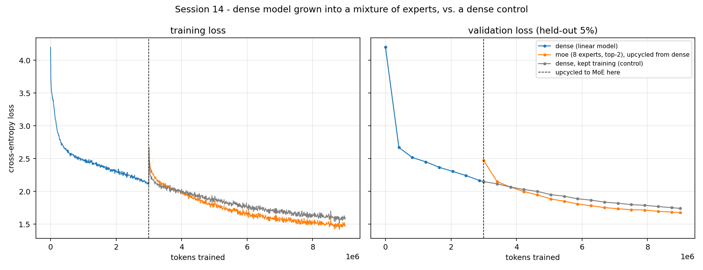
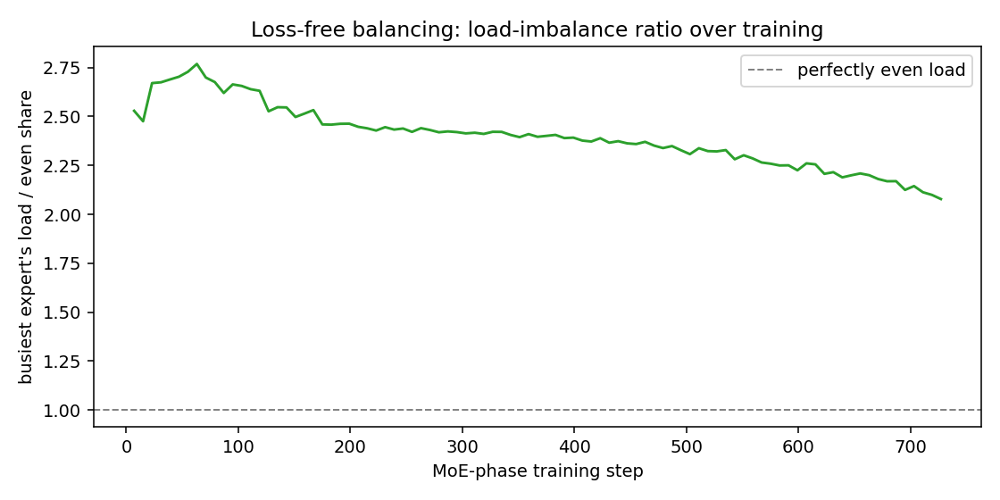

# Session 14 — Grow a linear model into a mixture of experts, and keep training it

[](https://colab.research.google.com/github/subramanyanaik/schoolofai_subbu/blob/main/assignment14/moe_llm.ipynb)

-blue)


**Session-14 assignment.** Train a linear (dense) model. Convert it into a mixture of
experts. Show that it keeps training — loss keeps dropping — after the conversion. Model
size and data are an open choice; this one is a small character-level decoder-only
transformer, sized so all three runs (dense, MoE, dense control) train for real on a laptop
GPU in under five minutes, rather than sized to hit a parameter target.

> **Notebook:** [`moe_llm.ipynb`](moe_llm.ipynb) — runs fine on CPU for a model this size; a
> GPU just makes it faster.
> **Source of truth:** [`moe_llm.py`](moe_llm.py). The notebook is generated from it, cell
> for cell, by [`tools/build_notebook.py`](tools/build_notebook.py); edit the `.py`, not the
> notebook, and CI checks the two haven't drifted.
> **Numbers:** [`results/results.json`](results/results.json), written by a real run on the
> machine this repo was built on (an RTX 3050 Laptop GPU — unlike
> [assignment13](../assignment13), torch loads fine here), injected into this README by
> [`tools/render_numbers.py`](tools/render_numbers.py). Nothing below is typed by hand.
> **Training log:** [`results/run_log.txt`](results/run_log.txt) — the full stdout of the run
> that wrote `results.json`: training and validation loss and tokens/s every 50 steps for all
> three runs, the validation loss either side of the conversion, and the final table.
> `tools/build_notebook.py --execute` writes it from the executed notebook's outputs, so it
> always comes from the same run as the numbers.

---

## What was asked, and how this answers it

| # | the assignment | what's here |
|---|---|---|
| 1 | train a linear model | a small pre-LN decoder transformer where each block has exactly one feed-forward network (`DenseMLP`) — the "linear model" the session's own narrative starts from |
| 2 | convert it into an MoE | **sparse upcycling, copy method** (Komatsuzaki et al. 2022, named directly in the session): each layer's single `DenseMLP` is cloned into `n_experts=8` experts plus noise, behind a freshly initialized router — attention, embeddings and the LM head are untouched |
| 3 | show it continues to train and the loss drops | `results/loss_curves.png` — training continues directly on the upcycled weights with a fresh optimizer, no restart from random init. Both training **and held-out validation** loss jump briefly at the conversion and then keep falling for the rest of the run |
| — | (not asked, but needed to read #3 honestly) | a **dense control**: the same dense weights the MoE was built from, trained for the same extra tokens on the identical batch sequence. Without it, "the MoE ends lower than the dense model" would only mean the dense model stopped training earlier |

<!-- BEGIN:numbers -->
**Device:** `cuda`  |  **seed:** `1337`  |  **experts:** `8`  |  **top-k:** `2`

| run | starts from | total params | active params | tokens in this run | final train loss | final val loss | best val loss | tokens/s | wall clock | peak memory |
|---|---|---|---|---|---|---|---|---|---|---|
| `dense` | random init | 1,809,984 | 1,809,984 | 2,998,272 | 2.1289 | 2.1491 | 2.1491 | 125,864 | 0.4 min | 455 MiB |
| `moe` | `dense`, upcycled | 10,073,664 | 2,995,776 | 5,996,544 | 1.4677 | 1.6757 | 1.6757 | 31,160 | 3.2 min | 2188 MiB |
| `dense_continued` | `dense`, unchanged | 1,809,984 | 1,809,984 | 5,996,544 | 1.5823 | 1.7407 | 1.7407 | 128,093 | 0.8 min | 609 MiB |

- **Parameters:** the MoE has **5.57x** the dense model's total parameters but only **1.66x** its *active* parameters per token (**29.7%** of the MoE total).
- **Cost of the conversion:** validation loss went from **2.1491** (dense, end of its run) to **2.4700** (MoE, before its first training step).
- **The MoE keeps training:** over its 5,996,544 tokens, training loss went from 2.4607 to **1.4677** and validation loss from 2.4700 to **1.6757**.
- **Fair comparison (same starting weights, same 5,996,544 tokens, same batches):** the MoE's final validation loss (**1.6757**) is lower than the dense control's (**1.7407**), a difference of **0.0650**.
- **Overfitting check:** gap between final validation and training loss — `dense` +0.0202, `moe` +0.2080, `dense_continued` +0.1584. Validation loss is still at its lowest point at the end of every run, so none of them has started to overfit.




<!-- END:numbers -->

## Reading the results

- **The assignment's claim holds on held-out text, not just training text.** Validation loss
  jumps at the conversion (the noise and the untrained router cost something), recovers past
  the dense model's pre-conversion level within the first couple of validation checks, and is
  still falling at the end of the run.
- **The MoE beats the dense control, but it isn't a compute-matched win.** Copy upcycling
  makes every expert full-size, so with top-2 routing each token uses about 1.7x the dense
  model's parameters (see the parameters bullet above). Some of the gap may simply be that
  extra compute per token. A compute-matched comparison would need the *partition* method
  (each expert a slice of the dense layer, so top-k of them add up to one dense layer) or a
  wider dense control.
- **The MoE memorizes more.** Its gap between validation and training loss is wider than the
  control's, which is what extra capacity on a ~1M-character corpus should do. Neither run
  has started to overfit yet (validation is still at its lowest at the end of each), but on
  this corpus the MoE would get there first.

## Design choices, and why — tied directly to the session

**Copy upcycling, not partition.** The session covered two ways to grow a dense
feed-forward block into `E` experts: *partition* (slice the dense hidden layer into `E`
pieces) and *copy* (clone the whole thing `E` times and add noise). Copy was used here
because it has a clean, checkable invariant that partition doesn't: with zero noise, an MoE
layer built this way computes the dense layer's output **exactly**, regardless of which
experts a randomly initialized router happens to select — because every candidate is the
same function, and the renormalized gate always sums to 1 over whichever subset gets picked.
`tests/test_moe_math.py::test_zero_noise_upcycling_reconstructs_dense_exactly` checks this at
`top_k` = 1, 3 and 8 out of 8. The real run adds a small noise (`upcycle_noise_std=0.02`)
*specifically* to break that equivalence — without it, the "MoE" would just be a dense model
wearing a costume, forever, since gradient has no reason to differentiate identical experts.

**No shared expert.** The session's own reference table lists Qwen3 at zero shared experts,
next to models (DeepSeek-V3, Kimi K2, GLM-4.5) that use one. Both are legitimate choices; zero
was picked here to keep the "active vs. total parameters" story to a single number per layer
(`top_k` out of `n_experts`), rather than `top_k` routed plus one that's always on.

**Routing: softmax over all experts, keep top-k, renormalize.** Exactly the three-step
process the session walked through for Qwen3: `softmax(logits)` over all 8 experts, keep the
largest `top_k=2`, divide those two probabilities by their sum so the gate weights going into
the weighted sum add up to 1.

**Balancing: a bias, not an auxiliary loss — and only on a window, not every step.** The
session's own conclusion about the 2022-era auxiliary-loss approach was that its gradient
fights the language-modeling gradient through the same router weights, and traced this
forward to DeepSeek-V3's fix: a per-expert bias that nudges the *selection* score (`probs +
bias`) without ever touching the *gate weight* (still plain `probs`, renormalized) or the
training loss. The bias moves by a fixed `balance_gamma` each window, down for experts over
their fair share of the last window's tokens and up for experts under it —
`tests/test_moe_math.py` checks the arithmetic directly and also checks the *other* explicit
point from the session: balancing on a window of steps (`balance_every=8` here), not every
micro-batch, so an expert gets a fair chance to catch up before being judged (the "let the
cook work for three hours, then go check" point).

**Why character-level tokens.** Same reasoning as [assignment12](../assignment12) and
[assignment13](../assignment13): a BPE vocabulary's embedding table would dominate a model
this small, which would make the active-vs-total-parameter story (section 14's own running
theme) mostly a statement about the embedding table rather than about the feed-forward blocks
the assignment is actually about.

## The upcycling invariant, and why it's the load-bearing test here

A conversion that silently breaks the model (wrong weight slice, wrong tying, an off-by-one
in which expert gets which clone) would still "train something" — the loss would go down from
a bad starting point and look like success. That's exactly the failure mode `tests/test_moe_math.py`
is built to catch:

| test | what it would catch |
|---|---|
| `test_zero_noise_upcycling_reconstructs_dense_exactly` | a broken clone, a wrong weight copy, or a tying bug — at `noise_std=0` the MoE model's logits must match the dense model's bit-for-bit (`atol=1e-5`), for every `top_k` |
| `test_upcycle_preserves_attention_and_embeddings_exactly` | the conversion touching anything outside the feed-forward blocks, and the weight-tying between `tok_emb` and `head` surviving the in-place `.data.copy_` calls |
| `test_nonzero_noise_upcycling_perturbs_but_stays_close` | the real run's noise being either silently absent (no perturbation at all) or so large the "upcycle from trained weights" premise is pointless |
| `test_router_gate_sums_to_one`, `test_bias_affects_selection_not_gate_weight` | the router math itself — gate weights must sum to 1, and the balancing bias must be able to change *who* gets selected without changing *how much* a selected expert's output counts |
| `test_rebalance_pushes_busy_expert_down_and_idle_expert_up`, `test_rebalance_is_noop_with_no_tokens_seen`, `test_repeated_rebalancing_narrows_an_artificial_imbalance` | the loss-free balancing update itself — direction, magnitude, the no-tokens-seen edge case, and that repeated correction actually knocks a structurally-favored expert out of the top-k, not just nudges a number that never does anything |
| `test_param_counts_active_less_than_total_for_moe` | the active/total parameter accounting matching a hand-computed `per_expert * (n_experts - top_k) * n_layer` |
| `test_eval_mode_forward_does_not_feed_balancing` | validation passes leaking into the expert-load window, which would let scoring the model on held-out text move its training-time routing |
| `test_fixed_val_batches_are_identical_across_calls` | the validation batches changing between evaluations, which would make every validation number incomparable with every other |

## Running it

```bash
pip install -r requirements.txt
python moe_llm.py                             # trains both phases, writes results/
python -m pytest tests -q                     # 11 correctness tests, no GPU needed, ~5s
python tools/build_notebook.py --check        # notebook in sync with moe_llm.py?
python tools/render_numbers.py --check        # README numbers match results/results.json?
```

To rebuild the notebook after editing `moe_llm.py`:

```bash
python tools/build_notebook.py                # rebuild (no outputs)
python tools/build_notebook.py --execute       # rebuild and run it locally
```

## What's not literal here, stated plainly

| | what | why |
|---|---|---|
| **expert compute is dense, not sparsely dispatched** | every expert runs on every token; unselected experts are zeroed by the gate afterward, not skipped | a real gathered/scattered dispatch needs variable-length per-expert batches and is a kernel-engineering problem, not a modeling one — out of scope here. The parameter accounting (`param_counts()` → total vs. active) stands in for the compute saving a real dispatch would realize; this run does not measure tokens/s or memory the way a real sparse MoE would |
| **no capacity factor, no token dropping** | every token is served by its chosen experts, always | the session itself describes this as an obsolete 2023-era technique superseded by loss-free balancing plus "dropless" training, and says as much directly: "if you read any paper... talking about old architecture. We do not decide how many tokens are sent to a particular expert" |
| **`balance_gamma` and `balance_every` are fixed constants** | not learned, not annealed | the session mentions real deployments anneal this schedule (DeepSeek's 120B controller, `0.01 → 0.00001` over 752 steps); this keeps the one variable under test — does loss-free balancing work at all — isolated from an extra scheduling problem |
