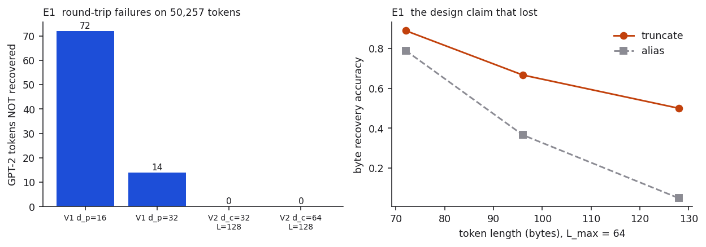
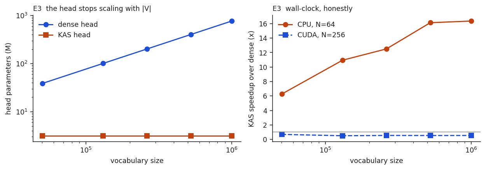
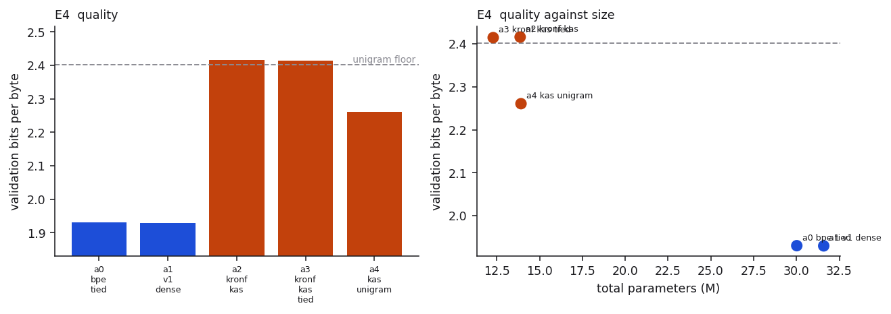
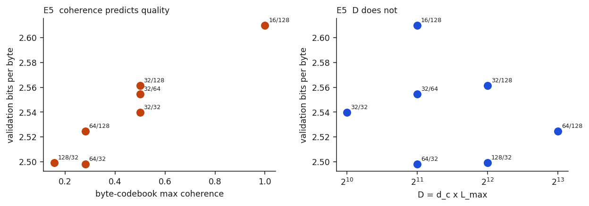
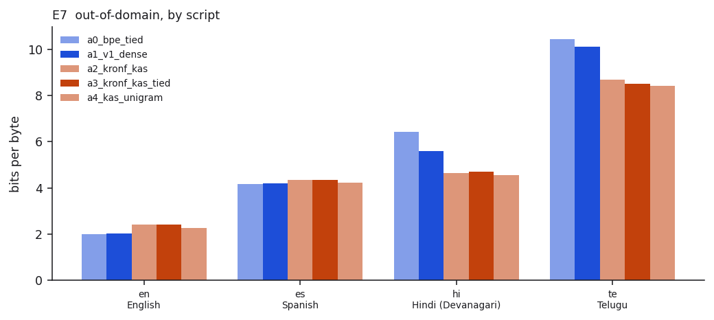
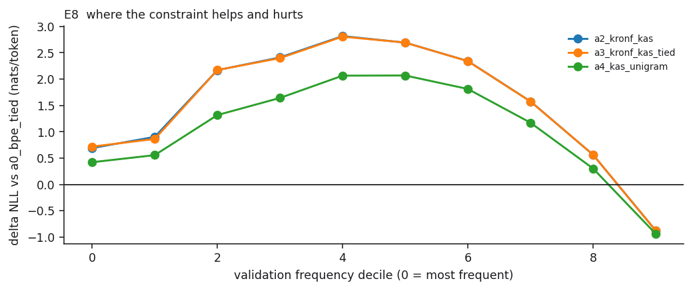

# Kronecker Embeddings V2 — Additive Softmax over Surface Forms

[](https://github.com/subramanyanaik/schoolofai_subbu/actions/workflows/validate.yml)


**Assignment 7. Problem solved: #5.**

> "Kronecker is forward deterministic (same word will always give the same
> embedding). How do I make a reverse of this (same embedding gives the same
> Kronecker)? If we can do this, then we can get rid of the final head as well!
> Then we can have a vocab of 1M as well without any issues!"

Base paper: [arXiv:2605.29459](https://arxiv.org/html/2605.29459v1), *Kronecker
Embeddings: Byte-Level Structured Token Representations for Parameter-Efficient
Language Models*.

**Every number in this README is read from a file in `results/`.** Run
`python experiments/report.py` to print them all and diff against the prose.

📊 **[Interactive write-up →](webapp/index.html)** — the same results as a
single self-contained page, with the codec **reimplemented in JavaScript and
running live**: type any string (Devanagari, Telugu, emoji) and watch it
round-trip, next to V1 losing the tail at 16 bytes. Open the file directly, or
serve it with `python -m http.server` from `webapp/`.

```bash
cd assignment7
pip install -r requirements.txt
python -m pytest tests/ -q          # 88 passed
python experiments/demo_invert.py   # the reverse-determinism demo
python experiments/e1_invertibility.py
python experiments/e3_cost.py
```

Those four need no GPU, no corpus, and no network beyond `tiktoken`'s
one-time GPT-2 download. They are where the evidence lives, and CI runs them
on a clean CPU-only checkout on every push.

To check the committed evidence without re-deriving it:

```bash
python experiments/verify_gates.py    # 19 gates and invariants
```

---

## Results at a glance

| | result | where |
|---|---|---|
| **Reverse determinism** | 100% exact recovery of all 50,257 GPT-2 tokens, 256,000 random byte strings, and 11 multi-script cases | [E1](#4--e1-invertibility) |
| **Softmax made vocabulary-free** | logits, partition function *and gradients* bit-identical to dense (<1e-10 fp64) | [E2](#5--e2-exactness) |
| **Output-head parameters** | 38.6M → 3.15M at 50k vocab; 768M → 3.15M at 1M (**244×**) | [E3](#6--e3-cost) |
| **Vocabulary 50k → 1M** | **Δparams = 0 exactly** (a dense head would need +384M, 4.6 GB Adam) | [E6](#9--e6-a-1m-vocabulary-for-zero-new-parameters) |
| **Length limit** | 8× V1's at matched D=4096; V1 loses 72 tokens, V2 loses none | [E1](#4--e1-invertibility) |
| **Weight tying** — "inapplicable" in the base paper §3.5 | works, and is **free**: −0.0013 bpb for −1,572,864 params | [E4](#7--e4-five-arms-token-matched) |
| **Out-of-domain Hindi / Telugu** | −27.8% / −16.7% bpb vs the dense head | [E7](#10--e7-out-of-domain-multi-script) |
| **In-domain quality** | **worse**: +0.426 bpb at the best codec config, +0.486 at the one E4 ran | [E4](#7--e4-five-arms-token-matched) |
| **Coherence predicts quality before training** | E5 predicted 0.063 bpb from a closed form; measured 0.0603 | [E5](#8--e5-which-knob-actually-matters) |
| **GPU wall-clock** | dense wins almost everywhere on this card; CPU is a 6–16× KAS win | [E3](#6--e3-cost) |

The most interesting result is a failure and its diagnosis. KAS lands
essentially **on the unigram entropy floor** — 2.4161 bpb against a 2.4025
floor — because the codec's `1/sqrt(L)` normalisation makes every output row
unit norm, so the head *structurally cannot hold a per-token frequency prior*.
Adding one scalar per token (50,257 params, 0.26% of the dense head) recovers
about a third of the gap. Most of what a dense output head's parameters buy is a
frequency table, not representational capacity.

The second most interesting is that this was measured, acted on, and the fix
predicted in advance. E5 found that **codebook coherence, not D, orders quality**
— and coherence has a closed form, computable without training. It said the
configuration E4 had already run was the sixth-best of seven and that a specific
better one was worth 0.063 bpb. Re-running the three KAS arms there gained
**0.0603 bpb while making every model smaller**, and moved A2 from just above
the unigram floor to 0.047 *below* it.

---

## Contents

| § | Section |
|---|---|
| [1](#1--what-problem-5-actually-asks-for) | What Problem 5 actually asks for |
| [2](#2--the-codec-and-the-inversion-theorem) | The codec, and the inversion theorem |
| [3](#3--kas-the-head-with-no-vocabulary) | KAS: the head with no vocabulary |
| [4](#4--e1-invertibility) | E1 — invertibility |
| [5](#5--e2-exactness) | E2 — exactness |
| [6](#6--e3-cost) | E3 — cost |
| [7](#7--e4-five-arms-token-matched) | E4 — five arms, token-matched |
| [8](#8--e5-which-knob-actually-matters) | E5 — which knob actually matters |
| [9](#9--e6-a-1m-vocabulary-for-zero-new-parameters) | E6 — a 1M vocabulary for zero new parameters |
| [10](#10--e7-out-of-domain-multi-script) | E7 — out-of-domain, multi-script |
| [11](#11--e8-where-the-constraint-helps-and-hurts) | E8 — where the constraint helps and hurts |
| [12](#12--claims-and-non-claims) | Claims and non-claims |
| [13](#13--what-this-does-not-prove) | What this does not prove |
| [14](#14--repository-layout) | Repository layout |

Two companion files: **[PART3_REBUILD.md](PART3_REBUILD.md)** is a complete
build specification (an agent with no context can rebuild this from an empty
directory, including ten traps that each cost real debugging time).
**[REPRODUCE.md](REPRODUCE.md)** is the command list for re-running what's
already here.

---

## 1 — What Problem 5 actually asks for

V1 replaces the *input* embedding table with a deterministic byte codec plus one
learned projection. It leaves `lm_head` alone — a dense `d_model × |V|` matrix,
100.7M parameters at |V|=131k, d_model=768, comparable to everything V1 saved.
The paper's own §8.5 lists "output-side Kronecker and unbounded effective
vocabulary" as future work, and §3.5 declares weight tying architecturally
inapplicable because `D ≠ d_model`.

Problem 5 asks for reverse determinism, and then draws the consequence: if the
embedding can be inverted, the output head can be *derived* rather than learned.

Pointing a surface-form encoder at the output is not itself new. Jozefowicz et
al. (2016) CNN-Softmax replaced both input and softmax embeddings with a
character CNN; Pappas et al. (2020) built the first word-level LM whose size
does not depend on the training vocabulary. Both cut parameters. Neither cuts
compute, and Jozefowicz et al. say why: computing perplexities still requires
the partition function, and their composition function is a neural network, so
`⟨h, CNN(chars_v)⟩` has no structure and all |V| inner products must be formed.

**The Kronecker codec is linear in byte-position occupancy — and no other
surface-form encoder is.** That single property is what changes the cost of the
softmax, and it is the whole reason this works.

```
logit(v) = ⟨S_pos, M_pos(v)⟩_F = (1/√L_v) · Σ_{p<L_v} A[b_p, p],    A = G · S_pos
```

`A` is a 256 × L_max table costing one small precompute per batch. After it,
every token's logit is a sum of `L_v` scalar lookups. No d-dimensional dot
product is ever formed, and the exact partition function comes along for free.

Equivalently, and this is how the code actually runs: **the output weight matrix
is replaced by the vocabulary's byte-occupancy matrix** — fixed, derived, zero
trainable parameters, 320,827 nonzeros, 0.019% dense, about 4 MB where the
dense head is 154 MB.

This does not change the objective. Training is still ordinary full-softmax
cross-entropy over |V|. KAS is an **exact reformulation** — bit-identical
logits, partition function and gradients — unlike hierarchical, adaptive or
sampled softmax, which define a *different* distribution. That is the most
likely misreading of this work, so it is stated up front and enforced by a test.

## 2 — The codec, and the inversion theorem

V1 is the special case `G = I₂₅₆, Φ = I_L`: both codebooks are the identity,
which is the sole cause of D=8192, the 32-character cap, and the sparsity
waste. V2 changes both.

- **Byte codebook** `G ∈ R^{256×d_c}` — Sylvester-Hadamard columns, forced to
  include the 8 Walsh bit-columns `{1,2,4,8,16,32,64,128}` first. All 256 rows
  are then *provably* distinct (the bit-columns recover the byte from the
  signs), so decoding is an **O(8) sign read**, cross-checked against a 256-way
  nearest neighbour. Column 0 (all-ones) is excluded from the pool: it carries
  no information about the byte and raises coherence for free.
- **Position basis** `Φ ∈ R^{L_max×L_max}` — real orthonormal Fourier rows with
  period **P = L_max**, making Φ orthogonal. The period is load-bearing:
  choosing a longer one clusters consecutive positions into a small arc of the
  circle and the system becomes ill-conditioned.

> **Theorem (exact inversion).** With `M_pos = (1/√L)·G_sel` padded to L_max
> columns and `Φ` orthogonal, `M_pos = (M_pos Φ) Φᵀ` holds exactly for every
> `L ≤ L_max` — one matmul, condition number 1, no pseudo-inverse.

Length falls out of the decode: the zero *vector* is reserved as "absent", so L
is the first column whose norm drops below threshold. Note this reserves the
zero vector, not the zero byte — `b"\x00"` is a perfectly representable byte
value, and `test_zero_byte_is_representable` pins that down.

On the output side Φ folds into `W_out` (orthogonal ⇒ exact change of basis,
same achievable logits, half the precompute), so the head has exactly two knobs,
`d_c` and `L_max`. Φ earns its keep on the input side only.

## 3 — KAS: the head with no vocabulary

```python
S   = (h @ W_out).view(-1, d_c, L_max)
A_T = einsum("vc,ncp->vpn", G, S).reshape(256*L_max, -1)   # transposed: no copy
logits = occ.matmul(A_T).t() * beta[lengths]                # (+ unigram)
```

`occ` is a parameter-free `nn.Module` holding three buffers, and its `matmul` is
a single fused `F.embedding_bag`. The head's *only* parameters are `W_out`
(`d_model × D`) — or nothing at all when tied — plus `beta`, one scalar per
token **length**, sized from `L_max` and never from the vocabulary.

Three further implementations ship alongside it — a CSR sparse matmul, the
naive length-bucketed slice-add loop, and a fully dense `S @ Kᵀ` reference. All
four agree to <1e-10. They are the evidence that the fast path is not cheating.

The input embedding is the **dual** of the same operation, and never
materialises a `|V| × D` table:

```python
Wpos = einsum("pk,ckm->cpm", Phi, W_proj.view(d_c, L_max, -1))
B    = einsum("vc,cpm->vpm", G, Wpos)
table = occ.matmul(B.reshape(256*L_max, -1))       # (V, d_model)
```

`test_table_equals_direct_encode` checks this against
`codec.encode(token_bytes) @ W_proj` to <1e-11. That identity is what licenses
the whole construction.

---

## 4 — E1: invertibility



`results/e1_invertibility.json`

| codec | D | exact / 50,257 | within L_max | truncated |
|---|---|---|---|---|
| V1 d_p=16 | 4096 | 50,185 (99.857%) | 100% | 72 |
| V1 d_p=32 | 8192 | 50,243 (99.972%) | 100% | 14 |
| **V2 d_c=32, L=128** | 4096 | **50,257 (100%)** | 100% | **0** |
| **V2 d_c=64, L=128** | 8192 | **50,257 (100%)** | 100% | **0** |

At matched D=4096 V1 truncates 72 tokens and V2 truncates none — **8× the
length limit at the same dimension.** Also exact on 256,000 random byte strings
at each of `d_c ∈ {16,32,64}`, and on real Devanagari, Telugu, CJK, Cyrillic,
Hebrew, Arabic and emoji. Sign-read and 256-way nearest-neighbour decoding agree
on 20,000 strings.

The demo (`python experiments/demo_invert.py`) shows the property directly:

| string | bytes | V2 (D=4096) | V1 (D=4096) |
|---|---|---|---|
| `apple` | 5 | OK `apple` | OK `apple` |
| `counterrevolutionaries` | 22 | OK `counterrevolutionaries` | LOST `counterrevolutio` |
| `भारत` | 12 | OK `भारत` | OK `भारत` |
| `తెలుగు` | 18 | OK `తెలుగు` | LOST `తెలుగ<?>` |
| `antidisestablishmentarianism` | 28 | OK (round-trips) | LOST `antidisestablish` |

```
embedding is a plain float vector: shape (1, 4096), norm 1.000000, no lookup table
forward deterministic: True    reverse deterministic: True
sign-read == nearest-neighbour decode: True
```

**A design claim that did not survive contact with measurement.** The original
specification said V2 should *alias* positions past `L_max` rather than
truncate, calling it graceful degradation. Measured byte-recovery accuracy at
`L_max = 64`:

| token length | truncate | alias |
|---|---|---|
| 72 | 0.889 | 0.789 |
| 96 | 0.667 | 0.366 |
| 128 | 0.500 | 0.050 |

Aliasing corrupts *every* position at once; truncation keeps a correct prefix.
Truncation is the default. The rejected alternative is kept and tested so the
comparison stays reproducible.

## 5 — E2: exactness

`tests/test_e2_exactness.py` — 17 tests, all fp64 unless stated.

| property | tolerance | status |
|---|---|---|
| logits vs dense, `d_c ∈ {16,32,64}` | <1e-10 fp64 | PASS |
| logits vs dense, fp32 | <1e-4 | PASS |
| all four implementations agree | <1e-10 | PASS |
| log-partition function `logsumexp` | <1e-10 | PASS |
| gradients w.r.t. `W_out`, `beta`, `h` | <1e-10 | PASS |
| cross-entropy loss | <1e-10 | PASS |
| tied path | <1e-10 | PASS |
| unigram-bias path | <1e-10 | PASS |
| head params invariant to `|V|` | exact | PASS |
| occupancy rows unit norm | <1e-14 | PASS |
| `Occupancy` has zero parameters | exact | PASS |

This is the gate that carries the evidentiary weight, because it is arithmetic
rather than measurement: it must hold on any machine.

## 6 — E3: cost



`results/e3_cost.json` · d_model=768, d_c=32, L_max=128, D=4096

| | V=50k | V=131k | V=262k | V=524k | V=1M |
|---|---|---|---|---|---|
| dense head params | 38.6M | 100.7M | 201.3M | 402.7M | 768.0M |
| **KAS head params** | **3.15M** | **3.15M** | **3.15M** | **3.15M** | **3.15M** |
| parameter ratio | 12.3× | 32.0× | 64.0× | 128× | **244×** |
| dense Adam state | 0.46 GB | 1.21 GB | 2.42 GB | 4.83 GB | 9.22 GB |
| op ratio (strict) | 9× | 20× | 34× | 53× | 73× |
| op ratio (excl. projection) | 28× | 53× | 74× | 92× | 103× |

Two op-count rows, because there are two defensible accountings and the smaller
one is the honest headline. The **strict** ratio charges KAS for the
`d_model → D` projection that a dense head does not need. The looser one counts
only the vocabulary-scaling part. Neither is a wall-clock claim.

**Wall-clock, honestly.** Ratio > 1 means KAS is faster.

| | V=50k | V=131k | V=262k | V=524k | V=1M |
|---|---|---|---|---|---|
| CPU, N=64 (fp32) | 6.27× | 10.94× | 12.50× | 16.12× | **16.35×** |
| CUDA, N=1 (bf16) | 0.53× | 1.06× | 0.88× | 0.94× | 1.33× |
| CUDA, N=256 (bf16) | 0.69× | 0.50× | 0.54× | 0.53× | 0.54× |

**Dense wins at batch on GPU.** A dense matmul is exactly what a GPU is best at,
and a 0.019%-dense sparse product cannot beat it at high arithmetic intensity.
The defensible wins are parameters, optimizer memory, exactness, and a genuine
CPU/small-batch speedup.

And the trap that made it viable at all, measured at N=256, V=50k:

| implementation | ms | vs dense |
|---|---|---|
| dense matmul | 3.01 | 1.00× |
| KAS slice-add loop (128 kernel launches) | 50.43 | 0.06× |
| KAS as a sparse matmul (`embedding_bag`) | 4.62 | 0.64× |

The obvious loop is **10.9× slower than the fused version** and 16× slower than
dense — latency-bound on tiny kernel launches, not compute-bound. Recognising
the operation as a sparse matmul is the difference between a curiosity and a
method.

## 7 — E4: five arms, token-matched



`results/e4_train_arms.json`

**5,001,216 tokens per arm**, identical budget for every arm, FineWeb-Edu,
d_model=384, 6 layers, 6 heads, block 256, batch 8, seed 0. Single seed —
directional.

| arm | val bpb | ppl | params | head params | tok/s |
|---|---|---|---|---|---|
| A0 BPE + tied dense head | **1.9301** | 473.8 | 30.02M | 0 (tied) | 18,726 |
| A1 V1 codec + dense head | **1.9296** | 473.1 | 31.59M | 19,298,688 | 16,195 |
| A2 Kronecker-F + KAS | 2.4161 | 2234.9 | 13.87M | 1,572,993 | 6,592 |
| A3 Kronecker-F + KAS, tied | 2.4147 | 2225.5 | 12.29M | **129** | 6,591 |
| A4 KAS + 1 scalar/token | 2.2608 | 1361.6 | 13.92M | 1,623,250 | 6,500 |
| *unigram-only floor* | *2.4025* | — | — | — | — |

Four readings, in order of how much they matter.

**1. A1 ≈ A0.** 1.9296 vs 1.9301 — a tie at 5M tokens. The paper reports 2.5%
lower loss than BPE at 2.5B tokens; this run is ~1/500th of that compute. Not a
contradiction, just far short of the regime where the effect appears.

**2. Weight tying is free — in fact slightly better.** A3 costs **−0.0013 bpb**
and saves **1,572,864 parameters**. Its head has 129 parameters total, which is
`beta` and nothing else. The base paper §3.5 calls tying architecturally
inapplicable because `D ≠ d_model`; routing the head through the codec makes the
dimension mismatch irrelevant, and it works.

**3. KAS loses badly, and lands on the unigram floor.** 2.4161 against a 2.4025
unigram entropy — **+0.0135 above the floor**. The surface-form head learned
almost nothing beyond token frequency. *(This is the reading that changes when
the codec is configured properly — see [§8](#8--e5-which-knob-actually-matters),
where the same arm clears the floor by 0.047.)*

**Why.** The codec's `1/√L` normalisation makes every row of the output matrix
unit norm. Measured on the fp32 buffers: min 0.99999997, max 1.00000004, std
1.94e-08; the fp64 test asserts the deviation is below 1e-14. A dense head
encodes each token's unigram log-prior *for free, in the magnitude of its row*.
KAS has no per-token magnitude at all. Its only per-token freedom is `beta`
indexed by length — **129 values shared across 50,257 tokens**.

**4. A4 tests that diagnosis, and it holds.** Add exactly one learned scalar per
token — nothing else changes:

| | head params | bpb | gap vs A0 |
|---|---|---|---|
| A0 dense head | 19,298,688 | 1.9301 | — |
| A2 KAS | 1,572,993 | 2.4161 | +0.4860 |
| **A4 KAS + unigram bias** | 1,623,250 | **2.2608** | **+0.3307** |

**50,257 extra parameters — 0.26% of the dense head — recover 32% of the gap.**
The mechanism is confirmed; the magnitude is smaller than the reference run's
65%, and the likely reason is budget: 50,257 fresh scalars each see only the
occurrences of their own token in 2,442 optimizer steps, so most of them barely
move. Expect this fraction to rise with tokens.

⚠️ These three arms ran at `d_c=32, L_max=128`, which [§8](#8--e5-which-knob-actually-matters)
later shows is the sixth-best of seven configurations. Re-run at the config E5
recommends, every one of them improves *while getting smaller* — the table is
in §8, and these numbers should be read as a lower bound.

This cuts both ways, and it is worth stating plainly. It is the strongest result
here — *most of a dense output head's parameters are buying a frequency table* —
and it is also a departure from claim C1: A4 is no longer zero-vocabulary-
parameter. It costs 1 scalar per token instead of `d_model = 384`, a 384×
reduction rather than an elimination. **C1 as stated holds only for A2/A3.**

KAS is also 2.8× slower to train here, because the input table is rebuilt from
the codec every step. For inference it would be cached once; for a fair training
comparison it is not.

## 8 — E5: which knob actually matters



`results/e5_d_sweep.json` · 1,499,136 tokens per
run — **comparable within this sweep only, not against E4**.

Seven configurations, sorted by quality:

| d_c | L_max | D | bpb | params | max coherence |
|---|---|---|---|---|---|
| 64 | 32 | 2048 | **2.4979** | 12.29M | 0.281 |
| 128 | 32 | 4096 | 2.4993 | 13.87M | 0.156 |
| 64 | 128 | 8192 | 2.5244 | 17.01M | 0.281 |
| 32 | 32 | 1024 | 2.5397 | 11.51M | 0.500 |
| 32 | 64 | 2048 | 2.5544 | 12.29M | 0.500 |
| 32 | 128 | 4096 | 2.5613 | 13.87M | 0.500 |
| 16 | 128 | 2048 | 2.6099 | 12.29M | 1.000 |

**D does not predict quality. Codebook coherence does.**

| | Spearman vs bpb |
|---|---|
| byte-codebook max coherence | **+0.964** |
| D = d_c × L_max | **−0.071** |

At an identical D=2048 the sweep spans 0.112 bpb; at D=4096 it spans 0.062. The
smallest D in the sweep (1024) beats three configurations, two and four times
its size. Meanwhile coherence is almost perfectly rank-correlated with quality.

The design-time claim that "D is the only capacity knob" is therefore **false**,
and the correction is more useful than the original claim:

- **What matters is how close to mutually orthogonal the 256 byte codes are.**
  `d_c=16` is degenerate — coherence 1.000 means some codes are exactly
  antipodal. Decoding still succeeds because the *sign* separates them, but the
  language model pays for the geometry.
- **`L_max` should be as small as coverage allows.** Mean token length is 6.38
  bytes, so high positions are nearly always empty and extending `L_max` spreads
  the codebook over cells that receive almost no gradient. Every `L_max=32` run
  beats every `L_max=128` run at equal `d_c`.
- **Coherence is computable in closed form without training**
  (`codebooks.coherence_stats`), so this is a configuration you can choose
  analytically instead of by sweeping.

⚠️ **The strict monotonicity gate fails, and I am not going to round it up.**
The reference run reported a *perfect* coherence ordering. Here there is exactly
one inversion, between the two best configurations: `d_c=128` has lower
coherence (0.156) but marginally worse bpb (2.4993 vs 2.4979) than `d_c=64`
(0.281). They are **0.0014 bpb apart** at a 1.5M-token budget — comfortably
inside noise, and I have one seed. The honest statement is the rank correlation
(+0.964), not "perfect ordering".

⚠️ **This means E4's headline comparison used a bad configuration.** A2/A3 ran
at `d_c=32, L_max=128` — sixth of seven. E4 was launched before this sweep
existed. So the correction was tested.

### What the correction is worth (`results/e4_best_config.json`)

The three KAS arms re-run at `d_c=64, L_max=32`, same 5,001,216-token budget,
same seed, same token stream. A0 and A1 are not re-run because they are
*unaffected by construction*: A0 has no codec, and A1's V1 codec is pinned at
`d_c=256, L_max=16` regardless — so their numbers are bit-identical.

| arm | d_c=32, L_max=128 | **d_c=64, L_max=32** | Δ bpb | params |
|---|---|---|---|---|
| A2 KAS | 2.4161 | **2.3557** | **−0.0603** | 13.87M → 12.29M |
| A3 KAS tied | 2.4147 | **2.3611** | −0.0537 | 12.29M → 11.51M |
| A4 KAS + unigram | 2.2608 | **2.2109** | −0.0500 | 13.92M → 12.34M |

**Every arm improves while getting smaller.** E5 predicted 0.063 bpb from the
coherence ordering alone; the measured gain is 0.0603 — a prediction made
*without training*, from a closed-form property of the byte codebook, and it
held to within 0.003 bpb. That is the strongest evidence here that coherence is
the right quantity to design against.

Two readings change as a result, and both matter:

- **A2 now sits 0.047 bpb *below* the unigram floor**, not 0.014 above it. At a
  bad configuration KAS learned essentially nothing beyond frequency; at a good
  one it clears the floor. This also puts this run on the *same side of the
  floor* as the reference run, which was 0.046 below — agreement reached by
  fixing the configuration, not by adjusting the interpretation.
- **Weight tying costs +0.0053 bpb** here rather than being free-and-better.
  It still buys back 786,432 parameters — exactly `D × d_model` — so the
  conclusion is unchanged: tying is essentially free, and the base paper §3.5
  calls it impossible.

The unigram bias still recovers about a third of the remaining gap (34.0%, up
from 31.9%), and still costs exactly 50,257 parameters. **The A2/A3/A4 numbers
in §7 stand as run, and should be read as a lower bound** — this table is what
the method achieves once E5's finding is applied.

⚠️ **Confound, stated.** `D = d_c × L_max` by construction, so neither factor
can be varied in isolation: moving `d_c` also moves coherence, moving `L_max`
also moves the exact-length limit (`L_max=32` truncates 14 of 50,257 tokens,
0.028%). Both axes are swept and both are reported for exactly that reason.

## 9 — E6: a 1M vocabulary for zero new parameters

`results/e6_vocab_swap.json`

| | |
|---|---|
| vocabulary | 50,257 → **1,000,000** |
| params before / after | 13,865,985 / 13,865,985 |
| **Δ parameters** | **+0** |
| occupancy matrix | 8,348,534 nonzeros (~100 MB) |
| a dense head would need | 384M params, 4.6 GB of Adam state |
| bpb, base → swapped | 2.3521 → 2.7898 |

The trained weights are loaded unchanged into a model with a 20× larger
vocabulary and it runs. Every trainable tensor is vocabulary-independent, so the
swap is a plain `load_state_dict`.

The bpb cost is real and stated in the JSON itself: probability mass now spreads
over 20× more classes the model never trained on. **The claim is feasibility at
zero parameter cost, not a quality gain** — and a dense head cannot do this at
all without allocating 384M parameters and retraining them.

*Disclosure:* the 1M vocabulary is 50,257 real GPT-2 tokens + 435,553 word forms
harvested from the training corpus + 514,190 deterministic synthetic byte
strings. The filler is there because the corpus does not supply a million
distinct forms; it is recorded in the results JSON rather than hidden. It does
not affect the parameter claim, which is what E6 tests.

## 10 — E7: out-of-domain, multi-script



`results/e7_ood_multiscript.json` — bits per byte,
Wikipedia, ~400k characters per language.

| arm | en | es | hi (Devanagari) | te (Telugu) | in-dom ppl |
|---|---|---|---|---|---|
| A0 dense | **2.0106** | **4.1604** | 6.4310 | 10.4354 | 472.2 |
| A1 V1 + dense | 2.0181 | 4.2001 | 5.6005 | 10.1041 | 473.2 |
| A2 KAS | 2.4161 | 4.3322 | 4.6450 | 8.6891 | 2268.3 |
| A3 KAS tied | 2.4131 | 4.3456 | 4.7043 | **8.5090** | 2262.7 |
| A4 KAS + unigram | 2.2723 | 4.2284 | **4.5666** | 8.4242 | 1377.3 |

Relative to the dense-head baseline:

| arm | en | es | hi | te |
|---|---|---|---|---|
| A1 | +0.4% | +1.0% | **−12.9%** | −3.2% |
| A2 | +20.2% | +4.1% | **−27.8%** | **−16.7%** |
| A3 | +20.0% | +4.5% | −26.8% | **−18.5%** |
| A4 | +13.0% | +1.6% | **−29.0%** | **−19.3%** |

A 19.3M-parameter dense head has learned essentially nothing about Devanagari or
Telugu byte sequences. The codec head sees the same bytes it always did. **The
same fixed subspace that costs quality in-domain buys generalisation
out-of-domain — the two results are the same mechanism with opposite signs.**

Note A1: the V1 codec on the *input side alone*, with an ordinary dense head,
already buys −12.9% on Hindi at no in-domain cost whatsoever (+0.4% on English).
That is the cleanest result in this table, because A1 is not a flatter model —
its in-domain perplexity is 473.2 against A0's 472.2.

⚠️ **Confound, stated rather than glossed.** A2/A3 are substantially
higher-entropy models (ppl ~2265 vs A0's 472), and a flatter distribution is
automatically better on out-of-distribution text. Some unknown fraction of the
Hindi/Telugu margin is calibration, not byte-level transfer, and this experiment
cannot separate the two.

**And here my run is weaker than the reference's.** The reference argued the
effect is not *only* calibration because its tied arm beat the dense baseline on
Spanish. In my run it does not — A3 is +4.5% on Spanish, worse than A0. So that
particular argument does not replicate, and the confound stands more strongly
here. What survives is A1, which is not flat and still wins on Hindi. The clean
version of this experiment temperature-matches each arm on held-out in-domain
data before measuring OOD; it is not run here. **Treat the A2/A3/A4 magnitudes
as an upper bound on the true effect.**

## 11 — E8: where the constraint helps and hurts



`results/e8_token_buckets.json` — Δ = NLL(arm) −
NLL(A0) in nats/token, by validation frequency decile. Negative means KAS wins.

| decile | 0 (most frequent) | 2 | 4 | 6 | 8 | 9 (rarest) |
|---|---|---|---|---|---|---|
| A2 KAS | +0.690 | +2.170 | **+2.816** | +2.342 | +0.564 | **−0.874** |
| A3 KAS tied | +0.718 | +2.172 | +2.806 | +2.341 | +0.565 | −0.874 |
| A4 KAS + unigram | +0.422 | +1.317 | +2.065 | +1.813 | +0.303 | **−0.935** |

**The sign flips on the rarest decile.** This was the design-time prediction and
it is what the data shows: frequent tokens need the unigram prior KAS cannot
express; rare tokens need the surface-form generalisation the dense head never
learns. Damage peaks in the mid-frequency band and reverses in the tail.

A4's whole curve sits below A2's — the unigram bias helps most where the missing
frequency prior hurt most (deciles 2–6) — and *still* wins slightly harder in
the tail. The two mechanisms are separable, which is what the diagnosis
predicted.

---

## 12 — Claims and non-claims

**Claims.**

- **(C1)** Full-vocabulary logits and the exact partition function in `O(B_V)`
  scalar ops with **zero vocabulary-dependent parameters**, bit-exact against
  dense. *Holds for A2/A3. A4 costs 1 scalar per token and is a 384× reduction,
  not an elimination.*
- **(C2)** Exact codec invertibility for `L ≤ L_max` — 100% on the GPT-2 vocab,
  256,000 random strings, and multi-script UTF-8.
- **(C3)** Vocabulary swappable at inference with **Δparams = 0 exactly**.
- **(C4)** At matched D, 8× the length limit of V1, with weight tying — which
  the base paper §3.5 calls architecturally inapplicable — restored, and free.

**Not claimed.**

- No GPU wall-clock speedup proportional to the op ratio. On this card dense
  wins at batch; the table showing that is in §6.
- No SOTA perplexity. This is a ~12–14M-parameter model on 5M tokens.
- Language-model results are **single-seed and directional**. E1 and E2 carry
  the evidentiary weight because they are theorems with machine-precision tests.
- C3 claims feasibility at zero parameter cost, not a quality gain — bpb rises.

**Known structural limitation.** Logits are confined to the row space of a fixed
surface-form subspace, and a learned `D×D` metric cannot widen it — it absorbs
into `W_out`.

## 13 — What this does not prove

Deviations from the reference run, all of them stated because they change how
much weight a number can carry.

| | this run | reference run |
|---|---|---|
| GPU | RTX 3050 Laptop, 4.3 GB | RTX 2000 Ada, 8.6 GB |
| corpus | FineWeb-Edu (streamed) | CC-News (local parquet) |
| E4 budget | 5,001,216 tokens/arm | 20,174,848 tokens/arm |
| E5 budget | 1,499,136 tokens/run | 6,000,000 tokens/run |
| E7 corpus | Wikipedia en/es/hi/te, built here | `../assignment2/data/*.faithful.txt` |

Consequences, honestly:

1. ~~**A2 sits slightly *above* the unigram floor**~~ — **resolved.** This was
   a configuration artefact, not a budget one. At `d_c=64, L_max=32` (§8) A2
   clears the floor by 0.047, putting this run on the same side as the
   reference's 0.046. What follows is the original finding at the config E4 ran:
   **A2 sits slightly *above* the unigram floor (+0.0135); the reference had it
   slightly below.** Same conclusion — KAS learns essentially nothing beyond
   frequency — reached from the other side of the floor at a quarter of the
   budget.
2. **A4 recovers ~a third of the gap, not 65%** — 31.9% at E4's config, 34.0%
   at the better one. 50,257 fresh scalars in 2,442 steps is not enough for most
   of them to move. The mechanism replicates; the magnitude is budget-limited,
   and unlike (1) the better configuration does *not* close this one.
3. **E5's strict monotonicity gate fails** by one inversion of 0.0014 bpb
   between the top two configs. Rank correlation is +0.964. See §8.
4. **E7's calibration confound is stronger here** because A3 does not beat A0 on
   Spanish. See §10.
5. **GPU wall-clock is worse for KAS here than in the reference** across the
   board. Same conclusion (dense wins at batch), held harder.

Everything hardware-independent reproduced exactly: E1's 72/14/0/0 truncation
counts, the 0.889/0.667/0.500 truncate-vs-alias accuracies, the 38.6M→3.15M
parameter table, `Δparams == 0`, and every E2 tolerance.

**Not done, in priority order.** (1) Multi-seed everything; all LM results here
are single-seed, which is the weakest thing about them. (2) Re-run E6, E7 and E8
from the `d_c=64, L_max=32` checkpoints — they were measured from the E4 config,
and §8 shows that config is not the method's best. (3) Temperature-match before
E7 so the OOD margin separates byte-level transfer from calibration. (4) Push
the coherence finding — it has a closed form and a known optimum (the Welch
bound), so codec design becomes analytic rather than a sweep, and §8 shows the
prediction already holds to 0.003 bpb.

*(The former item (1), re-running E4 at `d_c=64, L_max=32`, is now done and is
reported in §8.)*

**One bug worth recording**, because the parameter audit exists to catch exactly
this class. `beta` was originally sized from the vocabulary's *observed* longest
token rather than from `L_max`. Every arm trained fine; the only symptom was
that A2's parameter count crept by +33 between two vocabulary sizes — in a
project whose entire claim is that the head's parameter count does not depend on
`|V|`. `params_audit.py` failed, and it was right to.

## 14 — Repository layout

```
assignment7/
├── README.md               this file — results and argument
├── PART3_REBUILD.md        build specification + ten traps
├── REPRODUCE.md            command list
├── requirements.txt
├── pytest.ini
├── src/kronecker_v2/
│   ├── codebooks.py        Hadamard byte codes, orthonormal DFT positions, coherence
│   ├── codec.py            encode / decode / the inversion theorem
│   ├── vocab.py            length-sorted PackedVocab, GPT-2 surface forms
│   ├── kas_head.py         Occupancy + KASHead, four implementations
│   ├── model.py            KroneckerEmbedding (the dual) + GPT with five arms
│   ├── data.py             corpus -> uint32 bins in packed order
│   ├── train.py            token-matched training loop
│   └── eval.py             bpb, perplexity, unigram floor, token buckets
├── tests/                  88 tests; test_e2_exactness.py is the gate
├── experiments/            demo_invert, e1, e3-e8, params_audit, report, make_figures
├── webapp/index.html       interactive write-up; the codec, live, in JavaScript
├── results/                every number quoted above, incl. e4_best_config.json
└── figures/                every figure referenced above
```

`data/` (tokenized bins, OOD corpus) and `checkpoints/` (five trained arms) are
gitignored and regenerated by `prepare_data.py`, `build_ood_corpus.py` and
`e4_train_arms.py`.
