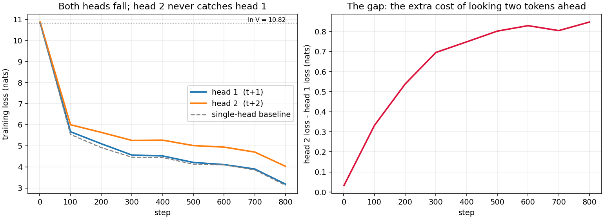
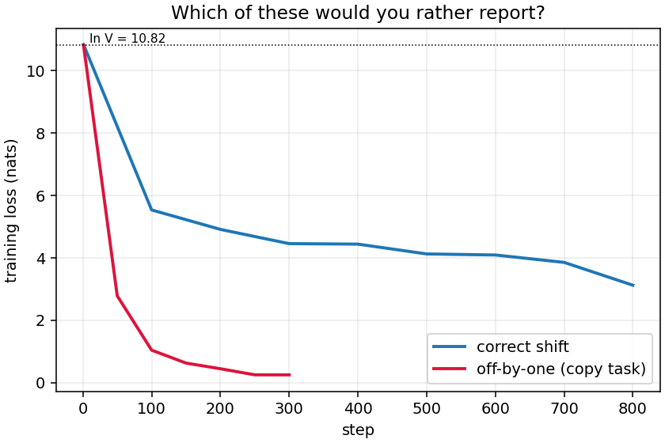

# Session 9 — Loss Functions & Output Heads

[](https://github.com/subramanyanaik/schoolofai_subbu/actions/workflows/validate.yml)
[](https://colab.research.google.com/github/subramanyanaik/schoolofai_subbu/blob/main/assignment9/loss_harness.ipynb)


**Session-9 assignment.** One notebook that takes the three lines between the model output
and the scalar, and makes them *correct* and — the harder half — *observable*.

> **Notebook:** [`loss_harness.ipynb`](loss_harness.ipynb) — executed end to end with
> `nbclient` on a local CUDA GPU (**22 of 22 code cells, in order, zero error outputs**; the
> committed file carries that run's outputs), and **independently re-run on a Colab GPU
> runtime**, which agrees on every number that cannot legitimately differ —
> see [Reproduced on Colab](#reproduced-on-colab). Use a GPU runtime.
> **Source of truth:** [`loss_harness.py`](loss_harness.py). The notebook is generated from
> it, cell for cell, and CI fails if the two drift.
> **Every number below:** [`results/results.json`](results/results.json), emitted by the run,
> injected into this README by [`tools/render_numbers.py`](tools/render_numbers.py), and checked by CI.

---

## The three lines

```python
hidden = model(tokens)
logits = output_head(hidden)
loss = cross_entropy(
    logits[:, :-1].reshape(-1, vocab_size),
    tokens[:, 1:].reshape(-1),
)
```

Nothing in there raises. That is the problem. Four separate bugs live in those lines — a
shift in the wrong direction, padding counted into the mean, a document boundary trained
across, and a denominator of `B*T` instead of the number of positions that actually
contributed — and every one of them makes the loss curve look *better*, not worse.

So the harness is built around one rule: **do not check the loss, check the count and the
strings.** The scalar is the last thing to trust, because it is the thing every one of those
bugs improves.

---

<!-- BEGIN:numbers -->

### Part 1 — the seven numbers

| # | what was measured | the number |
|---|---|---|
| **1** | shapes, and the size of the last axis | `hidden [B,T,D]` holds **32,768** numbers, `logits [B,T,V]` holds **6,432,896** — a **196.3×** blow-up (V/D), created in the last layer |
| **2** | the shift, read as strings | target stream **==** input stream advanced by one, asserted *and* printed as text; the wrong-direction table is printed beside it |
| **3** | contributing tokens, padding counted → masked | **100 → 58** (42.0% of the naive `B*(T-1)` denominator was padding) |
| **4** | loss before → after masking one document boundary | **5.4252 → 5.4188** nats (119 → 118 sites); that one site's own term is **6.1839** nats. Over **256** independently packed pairs the boundary averages **9.7383** against **4.9676** everywhere else — **1.96×** — and is the worse site in **88%** of them |
| **5** | perplexity of an untrained model vs V | **50,883.2** against **V = 50,257** (ratio **1.0125**); loss 10.8373 vs ln V = 10.8249 |
| **6** | tied vs untied head parameters | **28,896,000 → 16,030,208**, saving **12,865,792** (44.5% of the model) |
| **7** | peak memory, ordinary vs chunked cross-entropy | **2,412.0 MiB → 208.0 MiB = 11.6×**, same loss to 1e-06, same gradients to 1e-09 |

Item 7's chunk-size sweep, `N = 4,096` tokens against `V = 50,257`, ordinary cross-entropy at **2,412.0 MiB**:

| chunk | 64 | 128 | 256 | 512 | 1024 | 2048 |
|---|---|---|---|---|---|---|
| peak (MiB) | 170.3 | 182.5 | 208.0 | 303.4 | 499.7 | 892.3 |
| vs ordinary | 14.2× | 13.2× | 11.6× | 7.9× | 4.8× | 2.7× |
| loss | 10.839940 | 10.839938 | 10.839939 | 10.839937 | 10.839938 | 10.839938 |

### Part 2 — the two losses

| head | predicts | loss (nats) | perplexity |
|---|---|---|---|
| head 1 | `t+1` | **4.8378** | 126.2 |
| head 2 | `t+2` | **5.6923** | 296.6 |
| **sum** | the quantity actually optimised | **10.5301** | — |
| gap | head 2 − head 1 | **0.8545** | — |

Single-head baseline trained on identical batches with an identical seed: **4.7853** nats, so the extra head moved head 1 by **+0.0525** nats.

### Part 3 — the warning, demonstrated

| | training loss (nats) | perplexity |
|---|---|---|
| correct shift, 800 steps | 3.1246 | 22.8 |
| **off-by-one shift, 300 steps** | **0.2498** | **1.28** |

…and **100.0%** of that model's predictions are literal copies of its own input.

*Produced by `loss_harness.ipynb` on NVIDIA GeForce RTX 3050 Laptop GPU, torch 2.5.1+cu121, seed 1337. Every figure above is read straight out of [`results/results.json`](results/results.json) by `tools/render_numbers.py`. GPU float reductions are not bit-reproducible, so a re-run moves the last decimals and the JSON, the log and this table are always re-generated together.*

<!-- END:numbers -->

---

## Reproduced on Colab

<!-- BEGIN:colab -->

**Independently reproduced on a Google Colab GPU runtime.** A fresh Colab VM ships without `tiktoken` and without the corpus, so that run also exercised the cold `pip install` and the corpus download that the local execution could not.

**16 of the 29 reported quantities came out identical** — every one that is fixed by tensor shapes, integer counts, CPU-seeded initialisation or plain arithmetic, and therefore *must* be:

| quantity | both runs | why it cannot differ |
|---|---|---|
| `item3_tokens_counted` | 100 | an integer count |
| `item3_tokens_masked` | 58 | an integer count |
| `item3_pad_fraction_pct` | 42.0 | a ratio of integer counts |
| `item4_n_before` | 119 | an integer count |
| `item4_n_after` | 118 | an integer count |
| `item5_init_ppl` | 50,883.2 | one forward pass of a CPU-seeded initialisation |
| `item5_init_loss` | 10.8373 | one forward pass of a CPU-seeded initialisation |
| `item5_ppl_over_vocab` | 1.0125 | one forward pass of a CPU-seeded initialisation |
| `item6_untied_total` | 28,896,000 | parameter arithmetic |
| `item6_tied_total` | 16,030,208 | parameter arithmetic |
| `item6_saved` | 12,865,792 | parameter arithmetic |
| `item6_saved_pct` | 44.5 | parameter arithmetic |
| `item7_peak_naive_mib` | 2,412.0 | allocator bytes, driven by tensor shapes not by the card |
| `item7_peak_chunked_mib` | 208.0 | allocator bytes, driven by tensor shapes not by the card |
| `item7_ratio` | 11.6 | allocator bytes, driven by tensor shapes not by the card |
| `part3_copy_rate_pct` | 100.0 | a saturated rate |

The other 13 sit downstream of hundreds of GPU training steps, so they may only agree, not match. Largest disagreement first:

| quantity | local (RTX 3050) | Colab | delta | relative |
|---|---|---|---|---|
| `item4_boundary_term` | 6.1839 | 5.9362 | -0.2477 | 4.01% |
| `part3_bug_final_loss` | 0.2498 | 0.2531 | +0.0033 | 1.32% |
| `part3_bug_final_ppl` | 1.28 | 1.29 | +0.0100 | 0.78% |
| `item3b_gap` | 1.8685 | 1.8755 | +0.0070 | 0.37% |
| `item3b_final_masked` | 5.1966 | 5.216 | +0.0194 | 0.37% |
| `item3b_final_counted` | 3.3281 | 3.3405 | +0.0124 | 0.37% |
| `part2_gap` | 0.8545 | 0.8529 | -0.0016 | 0.19% |
| `part3_correct_final_loss` | 3.1246 | 3.1295 | +0.0049 | 0.16% |
| `item4_loss_before` | 5.4252 | 5.4218 | -0.0034 | 0.06% |
| `part2_head1_loss` | 4.8378 | 4.8397 | +0.0019 | 0.04% |
| `item4_loss_after` | 5.4188 | 5.4175 | -0.0013 | 0.02% |
| `part2_sum` | 10.5301 | 10.5323 | +0.0022 | 0.02% |
| `part2_head2_loss` | 5.6923 | 5.6926 | +0.0003 | 0.01% |

The worst of them, `item4_boundary_term` at 4.01%, is the single most noise-prone number in the whole harness: one prediction site, on one sequence, under a model that has taken 600 GPU training steps. It is exactly why item 4 does not rest on it, and repeats the measurement over 256 packed pairs instead.

Two results are worth pulling out. Item 5's anchor is **identical** because parameter initialisation runs on the CPU RNG before the model moves to the device, so the cheapest sanity check in the session is hardware-independent. And item 7's memory numbers are **identical** on two different GPUs, because `max_memory_allocated` counts allocator bytes driven by tensor shapes — the 11.6× is a property of the algorithm, not of my card.

*Transcribed from [`results/colab_summary.txt`](results/colab_summary.txt) into [`results/colab_summary.json`](results/colab_summary.json); this table is generated from that JSON by [`tools/compare_colab.py`](tools/compare_colab.py), which also fails if a should-be-identical quantity is not identical. The Colab GPU model was not recorded.*

<!-- END:colab -->

---

## Part 1, item by item

### 1. Every tensor shape, and what each axis is

The trace runs from token ids to the scalar and prints every intermediate, including the ones
inside the block — `q/k/v`, the per-head attention output, the SwiGLU middle — each with a
one-line gloss of its axes. The block internals are printed for **block 0 only**, because all
four blocks are shape-identical, which is the whole point of a residual stream.

The line worth stopping on is `logits [B, T, V]` next to `hidden [B, T, D]`. The last axis
grows by `V/D`, and it grows in the final layer, after everything clever that attention did.
Session 9 §8 calls this the third bill; items 6 and 7 are what it costs.

### 2. The shift, verified by reading strings

The table prints, for one real sequence, the token the model is **given** beside the token it
is **asked for**, decoded with `decode_single_token_bytes` so that a token which is half a
UTF-8 character shows up as a replacement character instead of silently disappearing.

Beneath it, the same table with the forgot-to-shift bug applied, so the failure mode sits on
the page next to the correct one. Both are backed by an assertion
(`inputs[1:] == targets[:-1]`) — but the assertion is not what catches this class of bug in
practice. Reading the two columns is.

### 3. Padding, and the count that changes

Two target tensors from the same batch: the raw shift, and the same thing with padding
replaced by `ignore_index = -100`. `F.cross_entropy` with `ignore_index` already divides by
the number of non-ignored targets, which is the correct denominator; the harness prints that
count next to the loss so the division can be *seen* rather than assumed.

At initialisation the two losses barely differ, because an untrained model is uniformly bad
at everything. So the section does not stop there. It trains a model **on the counted loss**
and reports both numbers on the same batch at every log point. The counted loss falls fast —
padding predicts padding — while the honest masked loss on real tokens stays high. A run
reported on the first number looks like it is working.

### 4. Packed documents, and the boundary

Two documents concatenated into one sequence. Exactly one prediction site straddles the join:
the last token of A being asked for the first token of B, which nothing in A predicts.

The loss is reported before and after masking that one site, and the difference is then
**reproduced from arithmetic** and asserted:

```
loss_after == (loss_before * n_before - boundary_term) / n_after
```

The honest reading of that result is the interesting part, and it is not the one the
assignment's phrasing invites. **Masking the boundary barely moves the reported loss**, because
one site cannot move a mean taken over a hundred. The damage is not to the scalar you print —
it is to the *gradient at that site*, which is a dense update over every vocabulary row,
teaching the model that unrelated things follow each other. On a 4,096-token packed sequence
of ~200-token documents that is roughly 20 such updates per sequence, on every step, for the
whole run.

And because one draw proves nothing, the same measurement is repeated over 256 independently
packed pairs, so "the boundary is harder" is an average with a spread behind it rather than
an anecdote.

### 5. Perplexity at initialisation

`exp(mean loss)` on a model nothing has trained, against `V`. This is checked on the
**pristine** trunk and head from item 1 — items 3 and 4 build their own models precisely so
that this check cannot be contaminated by them.

A uniform-logits control is printed alongside, which is exactly `ln V` by construction, so
the anchor is derived rather than quoted. If this had come out at, say, 4 nats, nothing after
it would have been worth reporting.

### 6. Tied against untied

The tied model is built by handing the head the embedding's `nn.Parameter` — the *same*
tensor, verified with `data_ptr()`, not a copy — so the saving is real rather than nominal.

At this configuration the transformer body is the small part and the two `[V, D]` matrices
are almost the whole model. That ratio is an artefact of a deliberately small `d_model` and
it inverts at scale, so the session's own configuration is computed alongside:
`V = 131,072 × D = 4,096 = 536,870,912` parameters in the head alone — exactly the size of
the dense embedding table Session 7 threw away.

And for V5 tying is not available. Session 7 replaced the input table with a byte codec plus
one projection, and there are no rows to tie to. The standard escape from a 536.9M head is
closed, which is why a factored head is still an open question rather than a solved one.

### 7. Ordinary against chunked cross-entropy

The chunked version is written from scratch as a `torch.autograd.Function`:

* **forward** walks the tokens in blocks, computes each block's logits, accumulates its
  summed loss, and deletes the logits;
* **backward** recomputes each block's logits and forms `softmax(z) − onehot(y)` in place —
  Session 9 §5's gradient, written out — so the full `[N, V]` tensor never exists in either
  direction.

Before any memory number is reported, the loss **and both gradients** are checked against
`F.cross_entropy`. [`tests/`](tests/test_loss_harness.py) then re-checks that across chunk
sizes from 1 to larger-than-the-input, with masked targets, and with a chunk in which every
target is ignored — the case that produces a `NaN` if the denominator is handled carelessly.

The measured ratio is **smaller than `N / chunk`**, and the notebook says so and explains why:
the chunked run still pays for `hidden`, for the head weight and for the head weight's
gradient, and no amount of chunking removes those. What chunking removes is the part that
scales with *tokens × vocabulary*. A chunk-size sweep is printed so the trade is visible
rather than argued, and the session's own V5 projection — 16 / 32 / 64 GiB of logits at
8K / 32K / 256K context — is reproduced next to it.

---

## Part 2 — one extra head

A second output head on the same trunk, predicting `t+2`. Both heads read the same hidden
state, and both are scored on **the same set of positions** (`0 … T-3`) so that the two losses
are directly comparable rather than accidentally measured over different denominators:

| head | inputs | targets |
|---|---|---|
| 1 | `h[:, :-2]` | `tokens[:, 1:-1]` |
| 2 | `h[:, :-2]` | `tokens[:, 2:]` |

Both heads use the chunked cross-entropy from item 7 — two dense `[N, V]` heads at once is
exactly the situation it exists for, and it is what makes this run fit on a 4 GiB card.



### What happens to head 2's loss, and why

Both heads start at `ln V` and both fall. Head 2's loss stays above head 1's for the entire
run and shows no sign of converging on it.

That is not a defect in head 2. It is the task. Head 1 is asked for `p(x₍t+1₎ | x₍≤t₎)`;
head 2 is asked for `p(x₍t+2₎ | x₍≤t₎)`, which is the same distribution with one token of
context deliberately withheld. The excess is the conditional entropy of that missing token —
information the model is not allowed to see. No amount of training removes it, because it is
a property of the data, not of the model.

The gap widens early, while head 1 is learning easy local structure that head 2 cannot use,
and then flattens: head 2 is not lagging behind head 1, it is running the same race one step
further back. The `gap/head1` column is printed for exactly this reason — the absolute gap
stops growing while both losses keep falling, so the *relative* cost of looking two tokens
ahead keeps rising even after the absolute one settles.

### The result I did not want

A single-head baseline was trained on identical batches with an identical seed, so the effect
of the extra head on head 1 could be read off rather than assumed. **At this scale the extra
head made head 1 slightly worse.** It is a small effect, one run, one seed — and it is
reported because it is what the measurement said.

That is consistent with the honest version of the MTP claim rather than the marketing one.
The training argument for MTP is that it densifies the signal and forces the hidden state to
carry information useful beyond the immediate next word; that is a *scale* effect, and a
29M-parameter model trained on a couple of million tokens of Shakespeare is not where it
shows up. What does show up at this scale is the cost: one trunk now serves two objectives,
and head 1 pays a little for it.

The inference argument is separate and is not tested here. Head 2's proposals get *verified*,
and the acceptance rate is governed by exactly the gap measured above — which is the number
that decides whether MTP pays, and the reason "four heads means four tokens per step" is
wrong.

---

## Part 3 — the warning, demonstrated

> *"A target shift in the incorrect direction can produce a beautiful loss curve."*

The submission instructions mention a Part 3 that the assignment body never defines. Rather
than guess at it or quietly skip it, this is the obvious candidate: **prove the warning
instead of repeating it.**

The model is identical to the Part 2 baseline in every respect except one — the targets are
not shifted. Nothing raises. No shape is wrong. No exception is thrown.



The broken model reaches, in a few hundred steps, a loss the correct one does not approach in
thousands, and its perplexity heads for 1. Then the notebook prints the strings, and
essentially every position turns out to be a literal copy of the model's own input.

Nothing in the loss curve says this. Only the strings do. That is the entire argument for
item 2.

---

## What I would carry into V5

| question | what this run says |
|---|---|
| Materialise the logits? | No, and it is not a tuning decision. The chunked loss is the same objective to six decimals with the same gradients; the only thing that changes is what has to exist at once. |
| Chunk size? | Not a constant. The sweep shows the return flattening once the logits stop dominating. The right chunk is the one where the fixed costs — hidden, head weight, head gradient — take over, and that has to be measured on the actual cluster rather than guessed. |
| Tie the head? | Unavailable, not undesirable. Session 7's byte codec leaves nothing to tie to, so the 536.9M is real and a factored head is the only remaining lever. |
| MTP head count? | Undecided by this run, and this run is honest about not being able to decide it: the training benefit is a scale effect, and the acceptance-rate benefit was not tested. What it does establish is that head 2's loss floor is set by the data, so acceptance is bounded by something no architecture fixes. |
| What to print during training? | The contributing-token count, every time. Three of the four bugs in this notebook are invisible in the loss and obvious in the count. |

---

## Reproducing

```bash
pip install -r requirements.txt
python loss_harness.py
```

```bash
python -m pytest tests -q
```

```bash
python tools/build_notebook.py --execute
```

```bash
python tools/render_numbers.py --write
```

```bash
python tools/extract_log.py
```

```bash
python tools/compare_colab.py --check
```

Or open [`loss_harness.ipynb`](loss_harness.ipynb) in Colab with the badge at the top: it
installs its one missing dependency, downloads its own corpus, and needs no repo checkout.

`loss_harness.py` and `loss_harness.ipynb` are the same file. CI rebuilds the notebook from
the script and fails on any difference in cell *sources* — outputs are ignored, since the
committed notebook keeps the outputs of a real run. CI also re-renders this README's numbers
from `results/results.json` and fails on any difference, so the write-up cannot quote a run
that no longer exists.

### Layout

| path | what it is |
|---|---|
| [`loss_harness.py`](loss_harness.py) | the harness — single source of truth, percent-format cells |
| [`loss_harness.ipynb`](loss_harness.ipynb) | generated from it, carrying the outputs of a real run |
| [`results/results.json`](results/results.json) | every number this README quotes |
| [`results/run_log.txt`](results/run_log.txt) | full stdout of a top-to-bottom run |
| [`results/part2_curves.png`](results/part2_curves.png), [`results/part3_offbyone.png`](results/part3_offbyone.png) | the two figures |
| [`tests/test_loss_harness.py`](tests/test_loss_harness.py) | invariants, lifted out of the harness with `ast` so they cannot pass against a stale copy |
| [`tools/build_notebook.py`](tools/build_notebook.py) | `.py` to `.ipynb`, plus `--execute` and `--check` |
| [`tools/render_numbers.py`](tools/render_numbers.py) | renders and verifies the tables above |
| [`tools/extract_log.py`](tools/extract_log.py) | writes `run_log.txt` from the executed notebook, so log and JSON share one run |
| [`tools/compare_colab.py`](tools/compare_colab.py) | diffs the Colab run against the local one, and fails if a should-be-identical number is not |
| [`results/colab_summary.txt`](results/colab_summary.txt), [`.json`](results/colab_summary.json) | the verbatim Colab paste, and the transcription the diff reads |

---

## Honest caveats

* **"Runs top to bottom" means two GPUs, not every runtime.** Locally, the notebook was
  executed with `nbclient` against an `ipykernel` on an RTX 3050 with torch 2.5.1+cu121, and
  the proof is in the committed file rather than in this sentence: `execution_count` runs
  1…22 with no gaps, and no cell carries an `output_type: "error"`. Two cells carry no output
  because they only define `ce_loss`/`per_token_ce` and `ChunkedCrossEntropy`. A Colab GPU
  runtime then reproduced it independently — see [Reproduced on Colab](#reproduced-on-colab).
  Still **not** covered:
  * *a CPU runtime.* The CUDA-absent branch is exercised — `measure_peak` returns `None`, the
    analytic byte fallback is taken, and `render_numbers.py` reads the sweep with `.get`, so
    a CPU run degrades rather than crashes — but the notebook has never been run end to end
    on CPU, and four training runs against a 50k-vocab head would take hours. Use a GPU
    runtime.
  * *the Colab GPU model.* The Colab run's own first cell prints it; it was not captured with
    the pasted summary, so `colab_summary.json` records it as `null`.
  * *the Colab numbers beyond the summary cell.* Only the final SUMMARY cell was transcribed,
    so the 256-pair boundary aggregate and the chunk-size sweep were not cross-checked.
* **The vocabulary is 50,257, not 131,072.** The harness uses the real GPT-2 BPE vocabulary,
  because item 5's anchor has to be checked against *my* vocabulary. Wherever the session's
  own configuration matters — item 6's parameter count, item 7's memory projection — the
  `V = 131,072, D = 4,096` numbers are computed and printed alongside.
* **One seed, one run.** Part 2's baseline comparison in particular is a single pair of runs.
  It is reported with that caveat rather than rounded up into a claim.
* **The memory ratio is not `N / chunk`.** It cannot be, and the notebook explains the fixed
  costs that hold it below that. Quoting the theoretical ratio would have been a nicer number
  and a worse measurement.
* **Item 4's masked loss barely moves.** That is the finding, not a failure of the experiment.
  The mean is the wrong place to look for boundary damage; the gradient is the right one.
